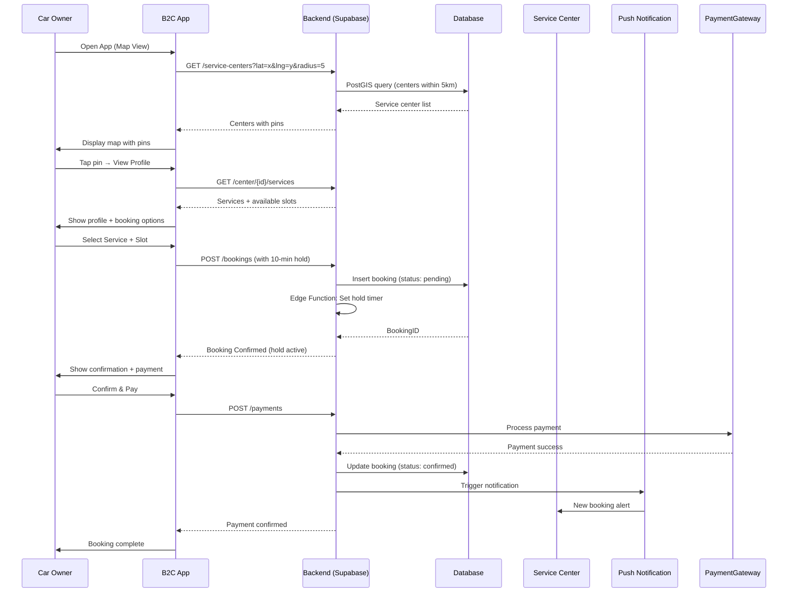
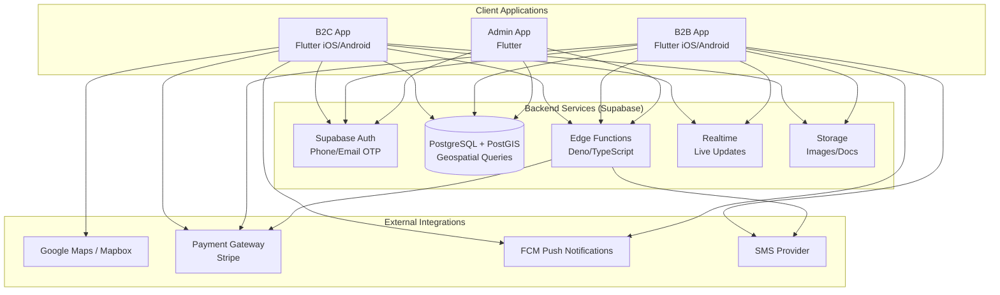
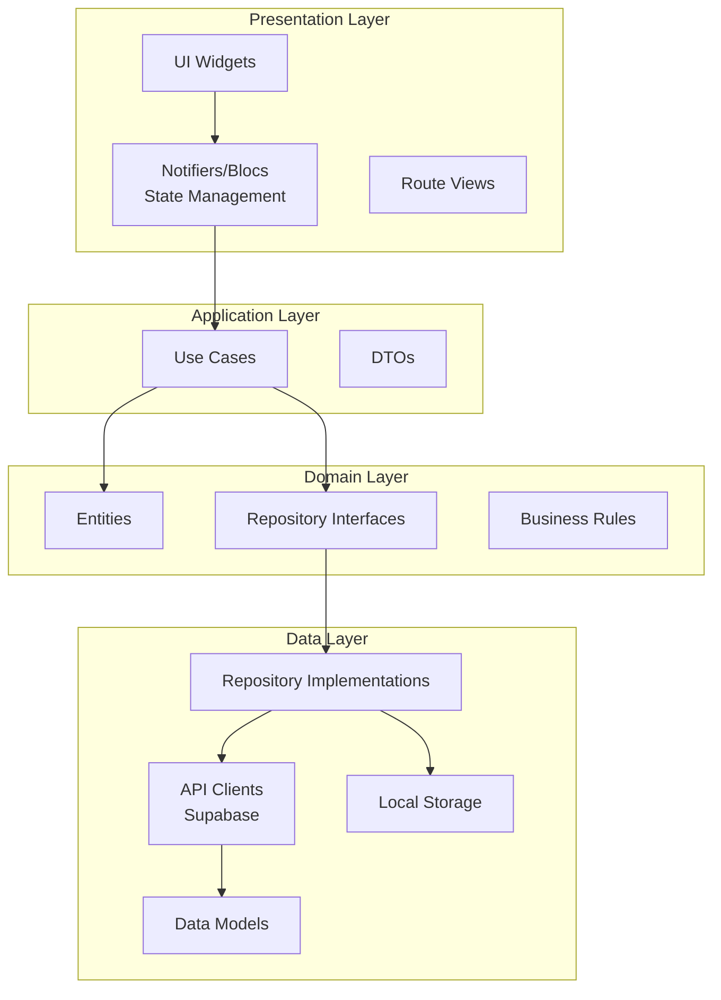

# Software Requirements Specification for CarCare

**Version:** 2.0  
**Date:** 2026-05-05  
**Author:** CarCare Development Team  
**Status:** Final  

This document defines the comprehensive software requirements for CarCare, a map-first automotive maintenance platform connecting car owners (B2C) with verified service centers (B2B). It covers all three product surfaces: B2C App, B2B Business App, and Admin App, built on Flutter with a Supabase backend.

-------------------------------------------------------------------------------

## 1. Introduction

### 1.1 Purpose
This SRS describes the complete scope, functional and non-functional requirements, interfaces, data definitions, use cases, and acceptance criteria for the CarCare system. It is intended for:
- Software development team (5 Flutter engineers, tech lead)
- Product management and stakeholders
- QA and testing team
- Future maintainers and contributors

### 1.2 Scope
**Product:** Map-first automotive maintenance marketplace platform

**In-Scope:**
- Three Flutter mobile applications (iOS/Android):
  - B2C App (car owners) - 26 screens
  - B2B App (service centers) - 16 screens
  - Admin App (operations) - minimal Flutter app
- Supabase backend (Postgres+PostGIS, Auth, Realtime, Edge Functions, Storage)
- Map-based service center discovery with geospatial queries
- Booking system with slot management and payment integration
- B2B dashboard with booking management and analytics
- Verification pipeline for service centers
- Bilingual support (English + Egyptian Arabic with RTL)
- Phased delivery across 6 phases (MVP + 5 expansion phases)

**Out-of-Scope for MVP:**
- Custom web clients (B2C, B2B, or admin)
- Self-hosted infrastructure
- Native iOS/Android code outside Flutter
- Advanced AI features (Phase 5)
- OBD-II integration (Phase 5)
- Parts marketplace (Phase 6)
- Multi-city expansion (Phase 6)

### 1.3 Definitions, Acronyms, Abbreviations
| Term | Definition |
|------|------------|
| B2C | Business-to-Consumer (car owners) |
| B2B | Business-to-Business (service centers) |
| MVP | Minimum Viable Product |
| GMV | Gross Merchandise Value (total booking value) |
| SLA | Service Level Agreement |
| RLS | Row-Level Security (Supabase) |
| PostGIS | PostgreSQL extension for geospatial queries |
| RBAC | Role-Based Access Control |
| JWT | JSON Web Token |
| PCI-DSS | Payment Card Industry Data Security Standard |
| GDPR | General Data Protection Regulation |
| CI/CD | Continuous Integration/Continuous Deployment |
| ER | Entity-Relationship (database model) |
| PDP | Product Detail Page |
| ETA | Estimated Time of Arrival |
| MAU | Monthly Active Users |
| NPS | Net Promoter Score |
| RTM | Requirements Traceability Matrix |
| PRD | Product Requirements Document |
| FR | Functional Requirement |
| NFR | Non-Functional Requirement |

### 1.4 References
1. CarCare PRD v2 (docs/CarCare_PRD_v2.md) - Product Requirements Document
2. CarCare MVP Plan (docs/MVP_PLAN.md) - Sprint planning and milestones
3. Requirements Traceability Matrix (docs/RTM.md)
4. CarCare App Flow PDF (docs/CarCare App Flow.pdf)
5. CarCare App Plan PDF (docs/CarCare App Plan.pdf)
6. Supabase Documentation (https://supabase.com/docs)
7. Flutter Documentation (https://docs.flutter.dev)
8. Google Maps Platform Documentation
9. Stripe API Documentation (payment processing)
10. WCAG 2.1 Guidelines (accessibility)

### 1.5 Overview
CarCare is a two-sided marketplace platform with a strategic focus on map-first discovery. The platform connects car owners who need maintenance services with verified service centers. The core value proposition is: *"Your car needs service — we'll show you where, when, and for how much."*

The system consists of:
- **B2C App:** Map-based discovery → booking → service → review workflow
- **B2B App:** Service center management → booking fulfillment → customer relationship management
- **Admin App:** Verification, dispute resolution, payout management

### 1.6 Diagrams

**Use Case Diagram (Mermaid code)**
```mermaid
usecaseDiagram
    actor CarOwner
    actor ServiceCenter
    actor Admin
    actor Mechanic
    
    CarOwner --> (Search Service Centers)
    CarOwner --> (Book Service)
    CarOwner --> (View Service Center Profile)
    CarOwner --> (Manage Vehicles)
    CarOwner --> (Track Maintenance)
    CarOwner --> (Rate and Review)
    CarOwner --> (Make Payment)
    
    ServiceCenter --> (Manage Catalog)
    ServiceCenter --> (Manage Bookings)
    ServiceCenter --> (View Dashboard)
    ServiceCenter --> (Respond to Reviews)
    ServiceCenter --> (Manage Customers)
    
    Admin --> (Verify Service Centers)
    Admin --> (Resolve Disputes)
    Admin --> (Manage Payouts)
    Admin --> (Moderate Content)
    
    Mechanic --> (Update Job Status)
    Mechanic --> (View Assigned Jobs)
    
    (Book Service) --> (Make Payment)
    (Manage Bookings) --> (Update Job Status)
```

**Booking Sequence Diagram (Mermaid code)**


**System Architecture Diagram (Mermaid code)**


**Clean Architecture Layers (Mermaid code)**


-------------------------------------------------------------------------------

## 2. Overall Description

### 2.1 Product Perspective
CarCare is a stand-alone mobile-first application ecosystem with:
- **Three Flutter mobile applications** sharing a common codebase structure
- **Supabase backend** (recommended) providing database, authentication, realtime, and serverless functions
- **No web clients** - all interactions happen via mobile apps
- **Third-party integrations** for maps, payments, notifications

The system may optionally use Firebase as an alternative backend, with trade-offs in geospatial query capabilities.

### 2.2 Product Functions

#### B2C App Functions (26 Screens)
| Function | Description | Priority |
|----------|-------------|----------|
| Map-First Home | Real-time map with nearby service centers, filters, search | Core MVP |
| Service Center Profiles | Verified badge, services, prices, ratings, reviews | Core MVP |
| Booking System | Pick service → slot → confirm → pay → review | Core MVP |
| Car Management | Add/edit/delete vehicles (multi-car support) | MVP |
| Maintenance Tracker | Auto-logged from bookings + manual entries | MVP |
| Smart Reminders | Mileage/time-based notifications | Phase 2 |
| Expense Tracker | Fuel, maintenance, insurance tracking | Phase 2 |
| Dashboard | Health snapshot, upcoming maintenance | MVP |
| Authentication | Email/phone login, bilingual support | MVP |
| Parts Marketplace | Browse/purchase car parts | Phase 4+ |

#### B2B App Functions (16 Screens)
| Function | Description | Priority |
|----------|-------------|----------|
| Onboarding | Business registration, document upload, verification | Core MVP |
| Business Dashboard | Today's bookings, KPIs, revenue stats | Core MVP |
| Booking Management | Accept/reject, assign mechanics, update status | Core MVP |
| Catalog & Pricing | Service menu CRUD, promotions | Core MVP |
| Customer CRM | History, follow-ups, broadcast offers | Phase 2 |
| Reviews Management | Respond to reviews, dispute flagging | MVP |
| Payments & Payouts | In-app collection, commission calculation | Phase 2 |
| Analytics | Conversion funnel, revenue breakdown | Phase 2 |
| Business Tiers | Free/Pro/Partner subscription management | Phase 2 |

#### Admin App Functions
| Function | Description | Priority |
|----------|-------------|----------|
| Verification Queue | Review and approve service centers | Core MVP |
| Dispute Resolution | Handle customer complaints | Core MVP |
| Payout Management | Process B2B payouts | Phase 2 |
| Content Moderation | Review ratings, photos, descriptions | MVP |

### 2.3 User Characteristics

#### Car Owners (B2C)
- **Demographics:** Car owners in target markets (initially one city)
- **Technical skills:** Basic smartphone usage
- **Pain points:** Finding reliable service centers, price transparency, tracking maintenance
- **Goals:** Quickly find and book trusted service centers, track car health

#### Service Centers (B2B)
- **Types:** Authorized dealers, independent garages, mobile mechanics
- **Roles:** Shop owners, reception staff, mechanics
- **Technical skills:** Basic to intermediate tablet/phone usage
- **Goals:** Steady booking flow, digital presence, customer management

#### Admin Users
- **Roles:** Operations team, verification team, dispute resolution
- **Technical skills:** Intermediate to advanced
- **Goals:** Maintain platform quality, resolve issues, manage payouts

#### Development Team
- **Size:** 5 Flutter engineers
- **Split:** ~2 B2C, ~2 B2B, 1 tech lead (shared packages, BaaS, admin)
- **Constraints:** No dedicated backend, web, or native engineers

### 2.4 Constraints
1. **Team Constraints:**
   - 5 Flutter engineers only (no backend/web/native specialists)
   - Must use managed backend (BaaS) - Supabase or Firebase
   - Single codebase per surface with shared packages

2. **Platform Constraints:**
   - Flutter mobile apps only (iOS + Android)
   - No web clients in roadmap
   - Adaptive layouts for phone + tablet (B2B)

3. **Data Privacy & Security:**
   - GDPR compliance for user data
   - PCI-DSS compliance for payment processing
   - Data encryption at rest and in transit

4. **External Dependencies:**
   - Supabase/Firebase availability
   - Payment gateway (Stripe or equivalent)
   - Google Maps/Mapbox API
   - FCM for push notifications
   - Stable network connectivity

5. **Performance:**
   - App and API respond within 2 seconds on primary screens
   - API responses under 500ms for core flows (p95)

### 2.5 Assumptions and Dependencies
**Assumptions:**
- Users have smartphones with GPS capability
- Stable internet connectivity available for core flows
- Service centers have tablets or phones for B2B app
- Target market has sufficient car density for marketplace liquidity

**Dependencies:**
- Supabase/Firebase platform stability and feature availability
- Third-party APIs (Maps, Payments, Notifications) remain operational
- App store approval processes for iOS and Android
- Payment gateway supports target market currencies and methods

-------------------------------------------------------------------------------

## 3. System Features (Functional Requirements)

### 3.1 Feature: User Management (B2C + B2B)

#### Description
Manage user accounts, roles, authentication, and profile information across all three apps.

#### Actors
Car Owner, Service Center Owner, Mechanic, Admin

#### Functional Requirements

**FR-1.1:** Users can register with email or phone number
- System sends OTP verification for phone registration
- Email registration requires email verification link
- Optional OAuth providers (Google, Apple) for MVP

**FR-1.2:** Users can log in/log out with email/phone and password
- JWT-based session management with short-lived access tokens
- Refresh token mechanism for session renewal
- Secure token storage using flutter_secure_storage

**FR-1.3:** Role-based access control (RBAC)
- Roles: Customer (B2C), Shop Owner (B2B), Mechanic (B2B), Admin
- Row-Level Security (RLS) policies in Supabase enforce data access
- UI adapts based on user role

**FR-1.4:** Password recovery
- Email-based password reset flow
- Phone-based password reset via OTP
- Multi-factor authentication optional for MVP

**FR-1.5:** Profile management
- Update personal information (name, phone, email)
- Upload profile photo
- Manage saved addresses
- Language preference (English/Arabic)

**FR-1.6:** Bilingual support
- Full UI localization in English and Egyptian Arabic
- RTL layout support for Arabic
- Language selection at onboarding with ability to switch later

### 3.2 Feature: Map-First Discovery (B2C Core)

#### Description
Real-time map interface showing nearby service centers with search, filters, and quick booking capabilities.

#### Actors
Car Owner

#### Functional Requirements

**FR-2.1:** Display nearby service centers on map
- PostGIS query to find centers within configurable radius (default 5km)
- Service center pins with rating, distance, price tier, ETA
- Auto-refresh map when user pans/zoomes

**FR-2.2:** Search functionality
- Search by service type (e.g., "oil change", "brake pads", "AC repair")
- Search by service center name
- Autocomplete suggestions
- Recent searches history

**FR-2.3:** Filter options
- Service type (multi-select)
- Price range (slider or min-max)
- Rating (minimum star rating)
- Distance (configurable radius)
- Open now toggle
- Verified/Authorized badge filter
- Emergency service toggle (24/7 providers)

**FR-2.4:** Service center quick preview
- Tap pin → show bottom sheet with:
  - Name, rating, distance
  - Price range for common services
  - Next available slot
  - Verified badge status
  - Quick action buttons (Call, Directions, Book)

**FR-2.5:** List view alternative
- Toggle between map view and list view
- Sort by: distance, rating, price, availability
- Infinite scroll with pagination

**FR-2.6:** Directions and contact
- One-tap directions via native maps app
- One-tap call to service center
- Share service center profile

**FR-2.7:** Emergency service mode
- Toggle to show only 24/7 service providers
- Highlight emergency services (tow, battery, mobile mechanic) - Phase 4

### 3.3 Feature: Service Center Profiles (B2C)

#### Description
Detailed service center information including services, pricing, reviews, and booking integration.

#### Actors
Car Owner

#### Functional Requirements

**FR-3.1:** Profile header
- Service center name, verified badge, overall rating
- Address, working hours, contact info
- Cover photo and gallery (multiple photos)
- Team info (mechanics, years in business)

**FR-3.2:** Services and pricing
- List of services with fixed prices or price ranges
- Service categories (Maintenance, Repair, Bodywork, etc.)
- "Get a quote" option for custom jobs
- Expandable service details (duration, what's included)

**FR-3.3:** Ratings and reviews
- Overall rating (1-5 stars)
- Category-based ratings: quality, price, speed, honesty
- Review list with pagination
- Review photos
- Helpful/unhelpful voting on reviews

**FR-3.4:** Live availability
- Next available slot display
- Real-time slot updates via Supabase Realtime
- "Book now" button with quick booking flow

**FR-3.5:** Business information
- Year established, number of mechanics
- Authorized dealer badges (if applicable)
- Service center type: authorized, independent, mobile

### 3.4 Feature: Booking System (B2C + B2B Core)

#### Description
End-to-end booking flow from service selection to payment and review.

#### Actors
Car Owner, Service Center, Mechanic

#### Functional Requirements

**FR-4.1:** Create booking (B2C)
- Select service from catalog or profile
- Choose available time slot
- Select vehicle from garage
- Add notes/special requests
- 10-minute slot hold via Edge Function to prevent double-booking

**FR-4.2:** Booking confirmation
- Review booking details (service, slot, price, vehicle)
- Accept cancellation policy
- Confirm booking
- Receive confirmation via push notification and in-app

**FR-4.3:** Payment integration
- Card payment via Stripe (or equivalent)
- Cash on service option
- Wallet payment (future)
- Generate invoice on completion

**FR-4.4:** Modify booking
- Reschedule with policy enforcement (e.g., 2 hours before)
- Cancel booking with refund rules
- Add/modify notes

**FR-4.5:** Booking management (B2C)
- View upcoming and past bookings
- Booking status tracking: pending → confirmed → in progress → completed → invoiced
- Live progress updates from B2B side

**FR-4.6:** Receive booking (B2B)
- Real-time notification of new booking (Supabase Realtime)
- View booking details (customer, vehicle, service, slot)
- Accept or reject with reason
- Propose alternative slot if needed

**FR-4.7:** Job status updates (B2B)
- Update status: received → in progress → completed → invoiced
- Assign specific mechanic to job
- Add internal notes per booking
- Notify customer of status changes automatically

**FR-4.8:** In-app chat (Phase 2, replaced by call+SMS in MVP)
- Message thread between customer and service center
- Push notifications for new messages
- Attachment support (photos)

**FR-4.9:** Post-service flow
- Generate invoice on job completion
- Send digital invoice to customer in-app
- Prompt customer for rating and review
- Auto-log service to maintenance tracker

### 3.5 Feature: Car Management (B2C)

#### Description
Manage multiple vehicles with detailed information and service history.

#### Actors
Car Owner

#### Functional Requirements

**FR-5.1:** Add vehicle
- Brand, model, year, mileage, plate number
- VIN (optional)
- Vehicle photo
- Color, transmission type, fuel type

**FR-5.2:** Edit/Delete vehicle
- Update vehicle information
- Delete vehicle (with confirmation)
- Soft delete to preserve booking history

**FR-5.3:** Multi-car support
- Users can add unlimited vehicles
- Set primary/default vehicle
- Quick switch between vehicles in booking flow

**FR-5.4:** Vehicle detail view
- Complete vehicle information
- Service history timeline (auto-logged + manual)
- Upcoming maintenance reminders
- Fuel and expense summary

### 3.6 Feature: Maintenance Tracker (B2C)

#### Description
Automatic and manual logging of all vehicle maintenance activities.

#### Actors
Car Owner

#### Functional Requirements

**FR-6.1:** Auto-logged entries
- Completed bookings automatically create maintenance records
- Auto-populate: service type, date, mileage, cost, service center
- Link to original booking and invoice

**FR-6.2:** Manual entries
- Add services done elsewhere
- Input: service type, date, mileage, cost, notes
- Upload receipt photo

**FR-6.3:** Timeline view
- Chronological list of all maintenance activities per vehicle
- Filter by service type
- Search by date range or service

**FR-6.4:** Service types
- Predefined common services (oil change, tire rotation, etc.)
- Custom service type creation
- Categorized display (routine, repair, bodywork, etc.)

**FR-6.5:** Export and sharing
- Export maintenance history as PDF
- Share with potential buyers (future resale feature)
- Email to insurance or warranty providers

### 3.7 Feature: Smart Reminders (B2C - Phase 2)

#### Description
Intelligent reminders for scheduled maintenance based on mileage and time.

#### Actors
Car Owner

#### Functional Requirements

**FR-7.1:** Mileage-based reminders
- Calculate based on last service mileage + standard intervals
- Example: "Oil change due in 200 km" (based on 5,000 km interval)
- Update mileage automatically from bookings or manual entry

**FR-7.2:** Time-based reminders
- Reminders based on time since last service
- Example: "6-month checkup due"
- Configurable reminder intervals per service type

**FR-7.3:** Push notifications
- Deliver reminders via FCM push notifications
- In-app inbox for reminders
- Tap notification → quick booking flow with 3 recommended centers

**FR-7.4:** Reminder settings
- Enable/disable reminder types
- Customize reminder thresholds
- Set preferred notification time

**FR-7.5:** Predictive reminders (Phase 3)
- AI-based predictions using booking history
- Seasonal maintenance suggestions
- Tire change reminders based on weather

### 3.8 Feature: Expense & Fuel Tracker (B2C - Phase 2)

#### Description
Track all vehicle-related expenses with categorization and analytics.

#### Actors
Car Owner

#### Functional Requirements

**FR-8.1:** Expense categories
- Fuel, maintenance, insurance, fines, registration, other
- Custom category creation
- Predefined subcategories

**FR-8.2:** Manual expense entry
- Amount, date, category, description
- Attach receipt photo
- Link to booking (if applicable)

**FR-8.3:** Auto-expense from bookings
- Completed bookings auto-create expense entries
- Auto-categorize as "maintenance"
- Preserve invoice details

**FR-8.4:** Fuel tracking
- Fuel amount, cost, odometer reading
- Calculate fuel efficiency (km/L or L/100km)
- Fuel station tracking (optional)

**FR-8.5:** Analytics and reports
- Monthly/yearly expense summaries
- Cost per km calculation
- Fuel consumption trends
- Category breakdown (pie chart)

### 3.9 Feature: B2B Onboarding (Business App)

#### Description
Service center registration, document upload, and verification process.

#### Actors
Service Center Owner, Admin

#### Functional Requirements

**FR-9.1:** Business registration
- Business name, address, tax ID, commercial registration
- Contact information (phone, email, website)
- Service center type: authorized dealer, independent, mobile
- Working hours setup (per day, with breaks)

**FR-9.2:** Document upload
- Commercial registration certificate
- Tax ID document
- Owner ID document
- Photos of facility (exterior, interior, workshop)
- Upload via Supabase Storage
- Support for PDF, JPG, PNG formats

**FR-9.3:** Service catalog setup
- Add services with name, description, category, price, duration
- Bulk import option (CSV/Excel)
- Set pricing: fixed price, price range, or "get a quote"

**FR-9.4:** Capacity and slot configuration
- Define working bays/mechanics count
- Set slot duration (default 30 minutes)
- Buffer time between appointments
- Blackout dates/holidays

**FR-9.5:** Verification process
- Admin reviews submitted documents (24-48h SLA)
- Approve, reject with reason, or request more info
- Email notifications to service center
- Verification pending screen blocks marketplace listing until approved

**FR-9.6:** Go live
- On approval, service center appears on B2C map
- Welcome email with tips for first booking
- Activation of booking management features

### 3.10 Feature: B2B Dashboard (Business App)

#### Description
Real-time dashboard for service centers showing bookings, KPIs, and revenue.

#### Actors
Service Center Owner, Mechanic

#### Functional Requirements

**FR-10.1:** Today's dashboard
- Live bookings count (pending, in progress, completed)
- Revenue today, this week, this month
- Upcoming bookings list (chronological)
- New booking notifications (realtime via Supabase)

**FR-10.2:** Booking calendar
- Weekly/monthly calendar view
- Color-coded by status
- Tap to view booking details
- Drag-and-drop rescheduling (future)

**FR-10.3:** KPI metrics
- Average rating
- Acceptance rate
- On-time completion rate
- Customer retention rate (new vs. returning)
- Revenue per mechanic

**FR-10.4:** Revenue analytics
- Daily, weekly, monthly revenue charts
- Service-level revenue breakdown
- Commission calculation transparency
- Export reports (CSV, PDF)

**FR-10.5:** Customer stats
- Total customers served
- New vs. returning customers
- Top customers by booking count
- Customer acquisition trends

### 3.11 Feature: B2B Catalog & Pricing (Business App)

#### Description
Manage service offerings, pricing, and promotions.

#### Actors
Service Center Owner

#### Functional Requirements

**FR-11.1:** Service CRUD
- Create, read, update, delete services
- Fields: name, description, category, price, duration, isActive
- Bulk pricing updates
- Duplicate service for quick creation

**FR-11.2:** Pricing models
- Fixed price (e.g., "Oil change - $30")
- Price range (e.g., "Brake repair - $50-$150")
- Quote on request (for complex jobs)
- Labor rate + parts pricing

**FR-11.3:** Service categories
- Predefined categories: Maintenance, Repair, Bodywork, Electrical, etc.
- Custom category creation
- Category ordering/display priority

**FR-11.4:** Promotions and discounts
- Create promotional offers (e.g., "20% off oil change")
- Set validity period
- Apply to specific services or entire catalog
- Promo code generation (future)

**FR-11.5:** Seasonal campaigns
- Holiday specials
- Seasonal maintenance packages (e.g., "Winter checkup")
- Bundle multiple services with discount

### 3.12 Feature: B2B Customer CRM (Business App - Phase 2)

#### Description
Customer relationship management for service centers.

#### Actors
Service Center Owner, Mechanic

#### Functional Requirements

**FR-12.1:** Customer history
- All bookings per customer
- Vehicles owned by customer
- Total spent, average ticket size
- Last visit date

**FR-12.2:** Vehicle service history
- Complete service record per vehicle at this center
- Link to invoices and receipts
- Notes per vehicle (preferences, issues)

**FR-12.3:** Follow-up reminders
- Auto-reminder: "Customer's next oil change due"
- Manual follow-up scheduling
- Reminder notifications to staff

**FR-12.4:** Broadcast offers
- Send promotional offers to past customers
- Filter by: last visit date, vehicle type, service history
- SMS or push notification (future)
- Track offer redemption rate

**FR-12.5:** Customer notes
- Internal notes per customer (preferences, complaints)
- Staff-only visibility
- Audit trail of note additions

### 3.13 Feature: B2B Reviews & Reputation (Business App)

#### Description
Manage customer reviews and maintain service center reputation.

#### Actors
Service Center Owner, Mechanic

#### Functional Requirements

**FR-13.1:** Review inbox
- List all customer reviews (new, responded, pending)
- Filter by rating, date, service
- Review details with photos

**FR-13.2:** Respond to reviews
- Text response to customer reviews
- Public visibility (shown on B2C profile)
- Response time tracking

**FR-13.3:** Dispute flagging
- Flag inappropriate or fake reviews
- Provide reason and evidence
- Admin review process

**FR-13.4:** Performance score
- Calculated metrics: acceptance rate, on-time rate, rating
- Displayed on B2C profile
- Benchmark vs. local centers (anonymized, Phase 3)

**FR-13.5:** Review analytics
- Rating trends over time
- Category-based rating breakdown
- Impact on booking conversion

### 3.14 Feature: B2B Payments & Payouts (Business App - Phase 2)

#### Description
Payment collection, commission calculation, and payout management.

#### Actors
Service Center Owner, Admin

#### Functional Requirements

**FR-14.1:** In-app payment collection
- Accept card payments via Stripe
- Generate payment links for customers
- Cash payment recording (with confirmation)
- Partial payment support

**FR-14.2:** Commission calculation
- Transparent commission display per booking
- Tiered commission rates: Free (15%), Pro (10%), Partner (8%)
- Commission deducted automatically from payouts

**FR-14.3:** Invoice generation
- Auto-generate invoice on job completion
- Invoice details: services, parts, labor, taxes, total
- PDF invoice generation and sharing
- Invoice numbering and tracking

**FR-14.4:** Payout schedule
- Weekly or monthly payout options
- Minimum payout threshold
- Payout method: bank transfer, wallet
- Payout history and statements

**FR-14.5:** Financial reports
- Revenue, commissions, payouts summary
- Tax reporting support
- Export financial data (CSV, PDF)

### 3.15 Feature: B2B Business Tiers (Phase 2)

#### Description
Subscription tiers for service centers with different features and benefits.

#### Actors
Service Center Owner, Admin

#### Functional Requirements

**FR-15.1:** Free tier
- Basic listing on map
- Limited bookings per month (e.g., 20)
- Standard commission (15%)
- Basic analytics

**FR-15.2:** Pro tier (monthly subscription)
- Priority in search results
- Unlimited bookings
- Lower commission (10%)
- Advanced analytics dashboard
- Customer CRM access
- Promotional tools

**FR-15.3:** Authorized Partner tier (annual contract)
- Verified badge on profile
- Featured placement in map search
- Dedicated account manager
- Lowest commission (8%)
- Custom integration support
- Priority support

**FR-15.4:** Subscription management
- Upgrade/downgrade tiers
- Payment for subscription
- Prorated billing
- Cancellation with notice period

### 3.16 Feature: Admin Verification Queue

#### Description
Review and approve service center registrations and documents.

#### Actors
Admin

#### Functional Requirements

**FR-16.1:** Pending verifications list
- List all service centers awaiting verification
- Sort by submission date (oldest first)
- Filter by: document status, business type, location

**FR-16.2:** Document review
- View all uploaded documents
- Zoom and download capabilities
- Verify authenticity and completeness
- Request additional documents if needed

**FR-16.3:** Verification decision
- Approve: service center goes live on map
- Reject: provide reason, service center can reapply
- Request info: ask for specific additional documents
- 24-48h SLA for verification

**FR-16.4:** Verification checklist
- Standardized checklist for reviewers
- Commercial registration valid
- Tax ID matches business name
- Photos show legitimate facility
- Contact info verified

**FR-16.5:** Email notifications
- Auto-email on approval with welcome tips
- Rejection email with reason and next steps
- Request info email with specific instructions

### 3.17 Feature: Admin Dispute Resolution

#### Description
Handle customer complaints and disputes between B2C and B2B users.

#### Actors
Admin

#### Functional Requirements

**FR-17.1:** Dispute submission (B2C)
- Customer can flag issue with booking
- Categories: poor service, overcharging, incomplete work, no-show
- Attach photos/evidence
- Request refund or resolution

**FR-17.2:** Dispute inbox (Admin)
- List all open disputes
- Priority flagging for urgent issues
- Filter by status, date, amount

**FR-17.3:** Dispute investigation
- View booking details, invoices, communications
- Contact both parties for information
- Request additional evidence

**FR-17.4:** Resolution actions
- Issue refund (partial or full)
- Deduct from B2B payout
- Warn or suspend service center
- Dismiss dispute if unfounded
- Money-back guarantee enforcement

**FR-17.5:** Dispute analytics
- Dispute rate per service center
- Common dispute reasons
- Resolution time tracking

### 3.18 Feature: Admin Payout Management (Phase 2)

#### Description
Process and manage B2B service center payouts.

#### Actors
Admin

#### Functional Requirements

**FR-18.1:** Payout queue
- List service centers eligible for payout
- Calculate payout amount (revenue - commissions - refunds)
- Minimum threshold check

**FR-18.2:** Payout processing
- Initiate bank transfers or wallet payouts
- Bulk payout support
- Transaction fee handling
- Payout confirmation and receipts

**FR-18.3:** Payout history
- Track all past payouts
- Payout status: pending, processing, completed, failed
- Retry failed payouts
- Generate payout reports

**FR-18.4:** Manual adjustments
- Adjust payout for disputes or refunds
- Bonus or penalty applications
- Audit trail for all adjustments

### 3.19 Feature: Notifications (All Apps)

#### Description
Communicate events via push notifications, email, and SMS.

#### Actors
Car Owner, Service Center, Mechanic, Admin

#### Functional Requirements

**FR-19.1:** Push notifications (FCM)
- Booking confirmed/cancelled
- Booking status updates (B2B → B2C)
- New booking alert (B2C → B2B)
- Reminder notifications (maintenance due)
- Review request after service
- Payment confirmations
- Payout notifications (B2B)

**FR-19.2:** Email notifications
- Registration verification
- Booking confirmation with details
- Invoice delivery
- Password reset
- Verification approval/rejection
- Dispute updates

**FR-19.3:** SMS notifications (B2B)
- New booking alert (fallback if no push)
- OTP verification
- Critical alerts

**FR-19.4:** In-app notifications
- Notification inbox in all apps
- Mark as read/unread
- Notification preferences
- Localized notification content (English/Arabic)

**FR-19.5:** Notification templates
- Configurable templates per notification type
- Support for variables (name, booking ID, etc.)
- Localization support

### 3.20 Feature: Parts Marketplace (Phase 4+)

#### Description
Browse and purchase car parts from service centers or dedicated sellers.

#### Actors
Car Owner, Service Center (as seller)

#### Functional Requirements

**FR-20.1:** Parts browsing (B2C)
- Search parts by name, part number, or car model
- Filter by: brand, price, availability, rating
- Product detail pages with specs, compatibility, reviews

**FR-20.2:** Parts catalog (B2B as seller)
- Add parts with SKU, name, description, price, quantity
- Set compatibility (car makes/models/years)
- Upload product photos

**FR-20.3:** Purchase flow
- Add to cart, checkout
- Payment processing
- Delivery or pickup options
- Order tracking

**FR-20.4:** Reviews and ratings
- Rate purchased parts
- Q&A section for products
- Seller ratings

-------------------------------------------------------------------------------

## 4. External Interfaces

### 4.1 User Interfaces

#### B2C App (Flutter iOS/Android)
- **Map Home Screen:** Full-screen map with bottom sheet for search/filters
- **Service Center Profile:** Scrollable detail view with sticky booking button
- **Booking Flow:** 3-step wizard (service → slot → confirm)
- **My Bookings:** Tabbed view (upcoming/past) with status indicators
- **Garage:** Card-based vehicle list with quick actions
- **Dashboard:** Widget-based home with health snapshot
- **Design System:** Material Design 3 with custom CarCare branding
- **Responsive:** Phone-optimized, 375px-428px width range

#### B2B App (Flutter iOS/Android)
- **Dashboard:** Tablet-optimized with side navigation, phone-adaptive
- **Booking Management:** List + detail views with status workflow
- **Catalog Editor:** Form-based CRUD with bulk actions
- **Analytics:** Charts and KPI cards
- **Design System:** Shared with B2C, business-oriented color scheme
- **Responsive:** Adaptive layouts for 7-10" tablets and phones

#### Admin App (Flutter)
- **Verification Queue:** List with document preview panels
- **Dispute Inbox:** Threaded view with action buttons
- **Payout Management:** Table view with filters and bulk actions
- **Minimal UI:** Functional over polished, efficient workflows

### 4.2 Hardware Interfaces

| Hardware | Purpose | Platform |
|----------|---------|----------|
| GPS | Map location, nearby center discovery | iOS/Android (B2C) |
| Camera | Document upload (B2B onboarding), receipt photos, review photos | iOS/Android (all apps) |
| Push Notifications | FCM token registration and receipt | iOS/Android (all apps) |
| Biometric (future) | Fingerprint/FaceID for login | iOS/Android (all apps) |
| OBD-II (Phase 5) | Real-time car diagnostics | Android (B2C, future) |

### 4.3 Software Interfaces

#### Supabase Backend (Recommended)
| Interface | Purpose | Details |
|-----------|---------|---------|
| Postgres + PostGIS | Database with geospatial queries | `postgis` extension for "centers within X km" queries |
| Supabase Auth | User authentication | Phone OTP, email, optional OAuth (Google, Apple) |
| Supabase Realtime | Live updates | Booking notifications, dashboard updates |
| Edge Functions (Deno) | Serverless logic | Slot-hold (10-min timer), webhook handlers, SLA timers |
| Supabase Storage | File storage | Center photos, verification docs, review photos, receipts |
| Row-Level Security | Data access control | Enforce B2C vs B2B vs Admin boundaries |
| Supabase Studio | Admin data work | Ad-hoc queries, user management, data fixes |

#### Alternative: Firebase Backend
| Interface | Purpose | Details |
|-----------|---------|---------|
| Firestore | NoSQL database | Requires GeoFlutterFire or geohash for spatial queries |
| Firebase Auth | User authentication | Phone OTP, email, OAuth providers |
| Cloud Functions | Serverless logic | Equivalent to Edge Functions |
| Cloud Storage | File storage | Similar to Supabase Storage |
| FCM | Push notifications | Primary push provider (also used with Supabase) |
| Firebase Console | Admin data work | Alternative to Supabase Studio |

#### Third-Party Integrations
| Service | Purpose | API/SDK |
|---------|---------|---------|
| Google Maps / Mapbox | Map display, geocoding, directions | Google Maps Flutter plugin / Mapbox Maps SDK |
| Stripe (or equivalent) | Payment processing | Stripe SDK, REST API |
| FCM (Firebase Cloud Messaging) | Push notifications | firebase_messaging Flutter plugin |
| SMS Provider (optional) | SMS notifications | Twilio or local provider API |

### 4.4 Communications Interfaces

| Interface | Protocol | Purpose |
|-----------|----------|---------|
| Client-Server | HTTPS (REST) | All API communication, encrypted in transit |
| Realtime | WebSockets (WSS) | Supabase Realtime for live booking updates |
| Push | FCM (HTTPS) | Push notification delivery |
| Maps | HTTPS | Map tile loading, geocoding requests |
| Payments | HTTPS | Payment gateway API calls |
| Email | SMTP/API | Transactional email delivery (SendGrid, etc.) |
| SMS | HTTPS API | SMS delivery (Twilio, etc.) |

-------------------------------------------------------------------------------

## 5. Non-Functional Requirements

### 5.1 Performance

| Metric | Target | Measurement |
|--------|--------|-------------|
| App launch time | < 2 seconds (cold start) | Measured on mid-range devices |
| Map load time | < 2 seconds (initial pins) | From map open to pins visible |
| Screen transition | < 300ms | Between screens in app |
| API response time | < 500ms (p95) | For core flows under normal load |
| PostGIS query (5km) | < 200ms | Nearby centers query |
| Search results | < 1 second | With filters applied |
| Booking creation | < 2 seconds (end-to-end) | From confirm to confirmation |
| Image upload | < 3 seconds (5MB photo) | Over 4G/WiFi |

**Load Targets (MVP):**
- 1,000+ active car owners
- 50+ verified service centers
- 500+ bookings/month
- Concurrent users: 100+ during peak

### 5.2 Security

#### Authentication & Authorization
- JWT-based authentication with short-lived access tokens (15 min)
- Refresh token rotation for session renewal
- Row-Level Security (RLS) policies in Supabase for data isolation
- Role-based access control (RBAC) enforced in UI and backend

#### Data Protection
- Encryption at rest: Supabase/Postgres encryption enabled
- Encryption in transit: TLS 1.3 for all HTTPS communications
- Sensitive data: Passwords hashed (bcrypt), payment data tokenized (Stripe)
- PII (Personally Identifiable Information) access logging

#### Payment Security
- PCI-DSS compliance via Stripe (no card data stored locally)
- Payment tokens used for transactions
- CVV never stored
- 3D Secure for card payments where applicable

#### Input Validation
- All user inputs validated client-side and server-side
- SQL injection prevention via parameterized queries (Supabase)
- XSS prevention via Flutter's built-in sanitization
- File upload validation (type, size, malware scan future)

#### GDPR Compliance
- User consent for data collection (onboarding)
- Right to access: export user data
- Right to delete: account deletion with data purge
- Data retention policies: bookings kept 7 years for tax, then anonymized
- Privacy policy and terms of service acceptance

### 5.3 Reliability & Availability

| Metric | Target | Notes |
|--------|--------|-------|
| System uptime | 99.9% | Excluding planned maintenance |
| API availability | 99.9% | Supabase SLA or equivalent |
| Data durability | 99.999% | Supabase Postgres with backups |
| Backup frequency | Daily | Automated Supabase backups |
| Disaster recovery | < 4 hours RTO | Recovery Time Objective |
| Graceful degradation | Core flows work offline | Booking history, garage (cached) |

**Retry Logic:**
- API calls: exponential backoff retry (3 attempts)
- Payment: idempotency keys to prevent double-charging
- Push notifications: fallback to email/SMS if FCM fails

### 5.4 Maintainability & Supportability

#### Code Structure
- Feature-first with Clean Architecture
- Clear separation: Presentation → Application → Domain → Data
- Shared packages for common code (design system, API client, models)
- Dependency injection via Riverpod or Bloc

#### Documentation
- Inline code comments for complex logic
- README per package/feature
- API documentation (Swagger/OpenAPI if custom backend)
- Architecture decision records (ADRs)

#### Observability
- Logging: structured logs (Supabase or Sentry)
- Metrics: performance monitoring (Sentry or Firebase Performance)
- Tracing: distributed tracing for API calls (future)
- Crash reporting: Sentry or Crashlytics

#### Versioning
- Semantic versioning for apps (e.g., 1.2.3)
- API versioning: Supabase auto-handles schema migrations
- Database migrations: versioned SQL files in `supabase/migrations/`
- Backward compatibility for at least 2 previous app versions

### 5.5 Portability

| Aspect | Requirement |
|--------|------------|
| Mobile platforms | iOS 14+, Android 8.0+ (API 26+) |
| Deployment | Cloud-hosted (Supabase/Firebase managed) |
| Containerization | Docker for local development (Supabase local) |
| Multi-cloud | Avoid vendor lock-in where possible (use abstractions) |
| Device compatibility | Support for phones (5-7") and tablets (7-10" for B2B) |

### 5.6 Accessibility

- WCAG 2.1 AA compliance for app UI
- Screen reader support (TalkBack/VoiceOver)
- Sufficient color contrast (4.5:1 minimum)
- Touch target size: minimum 44x44 points
- Text scaling support (up to 200%)
- RTL layout support for Arabic
- Keyboard navigation support (future web)

### 5.7 Localization/Internationalization

| Feature | Requirement |
|---------|------------|
| Languages | English (default), Egyptian Arabic |
| RTL support | Full RTL layout for Arabic |
| Date/time formats | Locale-specific (12/24h, DD/MM vs MM/DD) |
| Number formats | Locale-specific (decimal separator, digit grouping) |
| Currency | EGP (Egyptian Pound) for MVP, multi-currency future |
| Text expansion | Arabic text ~30% longer than English, UI must accommodate |
| Pluralization | Proper plural forms per language |

-------------------------------------------------------------------------------

## 6. Data Requirements

### 6.1 Data Model Overview

**Core Entities:**
1. **User** - All users (B2C, B2B, Admin) with roles
2. **ServiceCenter** - B2B businesses with profile, location, verification status
3. **Service** - Catalog items with pricing and duration
4. **Booking** - Core transaction between B2C and B2B
5. **Vehicle** - B2C user's cars with details
6. **MaintenanceRecord** - Auto-logged and manual service history
7. **Review** - Ratings and reviews for service centers
8. **Payment** - Payment transactions with status
9. **Invoice** - Generated invoices for completed jobs
10. **Notification** - Push/email/SMS notifications log
11. **Promotion** - B2B promotional offers
12. **Expense** - B2C expense tracking (fuel, maintenance, etc.)

### 6.2 Data Dictionary (Sample Core Tables)

#### User
| Field | Type | Constraints | Description |
|-------|------|-------------|-------------|
| user_id | UUID | PK | Unique identifier |
| email | VARCHAR(255) | UNIQUE, NULL | Email address |
| phone | VARCHAR(20) | UNIQUE, NULL | Phone number with country code |
| password_hash | VARCHAR(255) | NOT NULL | Bcrypt hashed password |
| role | ENUM | NOT NULL | 'customer', 'shop_owner', 'mechanic', 'admin' |
| first_name | VARCHAR(100) | NOT NULL | User's first name |
| last_name | VARCHAR(100) | NOT NULL | User's last name |
| profile_photo_url | TEXT | NULL | Supabase Storage URL |
| language_preference | VARCHAR(10) | DEFAULT 'en' | 'en' or 'ar' |
| is_active | BOOLEAN | DEFAULT true | Account status |
| created_at | TIMESTAMP | DEFAULT now() | Registration timestamp |
| updated_at | TIMESTAMP | NULL | Last update timestamp |

#### ServiceCenter
| Field | Type | Constraints | Description |
|-------|------|-------------|-------------|
| center_id | UUID | PK | Unique identifier |
| owner_id | UUID | FK → User | Link to shop owner |
| name | VARCHAR(255) | NOT NULL | Business name |
| description | TEXT | NULL | Business description |
| address | TEXT | NOT NULL | Full address |
| location | GEOGRAPHY(POINT) | NOT NULL | PostGIS point (lat,lng) |
| phone | VARCHAR(20) | NOT NULL | Contact phone |
| email | VARCHAR(255) | NULL | Contact email |
| website | VARCHAR(255) | NULL | Website URL |
| working_hours | JSONB | NOT NULL | Weekly schedule {mon: {open, close, breaks}} |
| center_type | ENUM | NOT NULL | 'authorized', 'independent', 'mobile' |
| is_verified | BOOLEAN | DEFAULT false | Verification status |
| verified_at | TIMESTAMP | NULL | Verification timestamp |
| rating_average | DECIMAL(2,1) | DEFAULT 0.0 | Overall rating (0.0-5.0) |
| rating_count | INT | DEFAULT 0 | Total number of reviews |
| price_tier | ENUM | NULL | '$', '$$', '$$$' for quick filtering |
| is_24_7 | BOOLEAN | DEFAULT false | Emergency service flag |
| capacity_slots | INT | DEFAULT 1 | Concurrent booking capacity |
| subscription_tier | ENUM | DEFAULT 'free' | 'free', 'pro', 'partner' |
| commission_rate | DECIMAL(4,2) | DEFAULT 15.00 | Commission percentage |
| created_at | TIMESTAMP | DEFAULT now() | Registration timestamp |
| updated_at | TIMESTAMP | NULL | Last update timestamp |

#### Booking
| Field | Type | Constraints | Description |
|-------|------|-------------|-------------|
| booking_id | UUID | PK | Unique identifier |
| customer_id | UUID | FK → User | B2C customer |
| center_id | UUID | FK → ServiceCenter | B2B service center |
| vehicle_id | UUID | FK → Vehicle | Customer's vehicle |
| service_id | UUID | FK → Service | Booked service |
| mechanic_id | UUID | FK → User, NULL | Assigned mechanic |
| slot_start | TIMESTAMP | NOT NULL | Appointment start time |
| slot_end | TIMESTAMP | NOT NULL | Appointment end time |
| status | ENUM | NOT NULL | 'pending', 'confirmed', 'in_progress', 'completed', 'cancelled', 'invoiced' |
| total_amount | DECIMAL(10,2) | NULL | Final price (may differ from service price) |
| notes | TEXT | NULL | Customer notes/requests |
| internal_notes | TEXT | NULL | B2B internal notes |
| hold_expires_at | TIMESTAMP | NULL | 10-min hold expiration |
| created_at | TIMESTAMP | DEFAULT now() | Booking creation |
| updated_at | TIMESTAMP | NULL | Last status change |

#### Vehicle
| Field | Type | Constraints | Description |
|-------|------|-------------|-------------|
| vehicle_id | UUID | PK | Unique identifier |
| owner_id | UUID | FK → User | B2C owner |
| brand | VARCHAR(100) | NOT NULL | Car brand (Toyota, BMW, etc.) |
| model | VARCHAR(100) | NOT NULL | Car model |
| year | INT | NOT NULL | Manufacturing year |
| mileage | INT | DEFAULT 0 | Current odometer reading |
| plate_number | VARCHAR(20) | NULL | License plate |
| vin | VARCHAR(50) | NULL | VIN (optional) |
| color | VARCHAR(50) | NULL | Vehicle color |
| fuel_type | ENUM | NULL | 'petrol', 'diesel', 'hybrid', 'electric' |
| transmission | ENUM | NULL | 'manual', 'automatic' |
| photo_url | TEXT | NULL | Vehicle photo URL |
| is_primary | BOOLEAN | DEFAULT false | Default vehicle flag |
| created_at | TIMESTAMP | DEFAULT now() | Added timestamp |
| updated_at | TIMESTAMP | NULL | Last update timestamp |

#### Service
| Field | Type | Constraints | Description |
|-------|------|-------------|-------------|
| service_id | UUID | PK | Unique identifier |
| center_id | UUID | FK → ServiceCenter | Owning service center |
| name | VARCHAR(255) | NOT NULL | Service name |
| name_ar | VARCHAR(255) | NULL | Arabic service name |
| description | TEXT | NULL | Service description |
| description_ar | TEXT | NULL | Arabic description |
| category | VARCHAR(100) | NOT NULL | Maintenance, Repair, Bodywork, etc. |
| price_type | ENUM | NOT NULL | 'fixed', 'range', 'quote' |
| price_min | DECIMAL(10,2) | NULL | Min price (range/quote) |
| price_max | DECIMAL(10,2) | NULL | Max price (range) |
| price_fixed | DECIMAL(10,2) | NULL | Fixed price |
| duration_minutes | INT | NOT NULL | Service duration |
| is_active | BOOLEAN | DEFAULT true | Available for booking |
| created_at | TIMESTAMP | DEFAULT now() | Created timestamp |
| updated_at | TIMESTAMP | NULL | Last update timestamp |

### 6.3 Relationships

```
User (1) ──── (many) Vehicle (B2C)
User (1) ──── (1) ServiceCenter (B2B owner)
User (1) ──── (many) Booking (B2C customer)
User (1) ──── (many) Booking (B2B mechanic)
ServiceCenter (1) ──── (many) Service
ServiceCenter (1) ──── (many) Booking
ServiceCenter (1) ──── (many) Review
Vehicle (1) ──── (many) Booking
Vehicle (1) ──── (many) MaintenanceRecord
Service (1) ──── (many) Booking
Booking (1) ──── (1) Payment
Booking (1) ──── (1) Invoice
Booking (1) ──── (1) Review (after completion)
```

### 6.4 Data Retention Policies

| Data Type | Retention | Action after |
|-----------|-----------|--------------|
| Active bookings | Indefinite | Keep |
| Completed bookings | 7 years | Anonymize customer data (tax/legal) |
| Failed bookings | 1 year | Delete |
| User accounts (active) | Indefinite | Keep |
| User accounts (deleted) | 30 days | Hard delete (GDPR) |
| Payment data | 7 years | Anonymize (tax/legal) |
| Logs | 90 days | Archive, then delete |
| Notifications | 6 months | Delete |

-------------------------------------------------------------------------------

## 7. System Architecture and Design Constraints

### 7.1 High-Level Architecture

**Pattern:** Feature-first with Clean Architecture

```
┌─────────────────────────────────────────────────────────────┐
│                    Flutter Apps (3 surfaces)                 │
│  ┌──────────┐  ┌──────────┐  ┌──────────┐                 │
│  │ B2C App  │  │ B2B App  │  │ Admin App│                 │
│  └────┬─────┘  └────┬─────┘  └────┬─────┘                 │
│       └──────────────┼──────────────┘                       │
│                    Shared Packages                          │
│         Design System │ API Client │ Domain Models          │
└──────────────────────────┬──────────────────────────────────┘
                           │ HTTPS/WSS
┌──────────────────────────┴──────────────────────────────────┐
│              Supabase Backend (Managed BaaS)                │
│  ┌──────────┐ ┌──────────┐ ┌──────────┐ ┌──────────┐      │
│  │ Postgres │ │  Auth    │ │ Realtime │ │ Storage  │      │
│  │ +PostGIS │ │ (OTP/    │ │ (Live    │ │ (Images/ │      │
│  │          │ │  Email)  │ │ Updates) │ │  Docs)   │      │
│  └──────────┘ └──────────┘ └──────────┘ └──────────┘      │
│  ┌──────────────────────────────────────────────┐          │
│  │ Edge Functions (Deno/TypeScript)             │          │
│  │ - Slot hold timer (10 min)                   │          │
│  │ - Webhook handlers (payments, SMS)           │          │
│  │ - Booking SLA timers                         │          │
│  └──────────────────────────────────────────────┘          │
└──────────────────────────┬──────────────────────────────────┘
                           │ API Calls
┌──────────────────────────┴──────────────────────────────────┐
│              Third-Party Integrations                       │
│  Google Maps/Mapbox │ Stripe │ FCM │ SMS Provider           │
└─────────────────────────────────────────────────────────────┘
```

### 7.2 Clean Architecture Layers (per feature)

```
Presentation Layer (MVVM-style)
├── Widgets (UI components)
├── Notifiers/Blocs (State management)
└── Routes (Navigation)

Application Layer
├── Use Cases (business logic per feature)
└── DTOs (Data Transfer Objects)

Domain Layer
├── Entities (business objects)
├── Repository Interfaces (contracts)
└── Business Rules (validators, calculators)

Data Layer
├── Repository Implementations
├── Supabase API Client
├── Local Storage (SharedPreferences/SecureStorage)
└── Data Models (DTOs ↔ Entities mapping)
```

### 7.3 Design Constraints

1. **Monorepo Structure:**
   - Single repository with 3 app folders + shared packages
   - Shared: design_system, api_client, domain_models, i18n, utils
   - Each app: feature-first folders (auth, booking, dashboard, etc.)

2. **State Management:**
   - Riverpod (recommended) or Bloc
   - Team to pick one and standardize
   - Avoid mixing state management approaches

3. **Navigation:**
   - go_router for declarative routing
   - Deep link support for notifications → screen

4. **Dependency Injection:**
   - ProviderScope (Riverpod) or BlocProvider (Bloc)
   - Feature-first DI (each feature provides its own dependencies)

5. **Database Access:**
   - Supabase Flutter client (supabase_flutter package)
   - Direct PostgREST queries or RPC for complex logic
   - PostGIS functions via Supabase RPC

6. **Realtime:**
   - Supabase Realtime channels for live booking updates
   - Subscribe in B2B dashboard, unsubscribe on dispose

7. **File Uploads:**
   - Supabase Storage buckets:
     - `center-photos` (public)
     - `verification-docs` (private, admin only)
     - `review-photos` (public)
     - `receipts` (private, user+admin)

### 7.4 Deployment Constraints

- **Flutter Apps:** iOS App Store, Google Play Store
- **Backend:** Supabase cloud (managed), no self-hosting
- **CI/CD:** GitHub Actions for app builds and deployments
- **Environments:** dev, staging, production (Supabase projects per env)
- **Feature Flags:** Remote config (Firebase Remote Config or Supabase edge config)

-------------------------------------------------------------------------------

## 8. Use Cases / User Scenarios

### Use Case 1: Customer Books a Service (Primary Flow)

**Actors:** Car Owner  
**Preconditions:** User is registered and logged in, has at least one vehicle added

**Flow:**
1. User opens app → map loads with nearby service centers (PostGIS query < 5km)
2. User searches or filters by service (e.g., "oil change")
3. User taps a pin → views service center profile with ratings, price, available slots
4. User taps "Book Now" → selects service from catalog
5. User selects vehicle from garage
6. User picks available time slot from calendar
7. System places 10-minute hold on slot (Edge Function timer)
8. User reviews booking details (service, slot, price, vehicle)
9. User confirms booking
10. User chooses payment: Card (Stripe) or Cash on Service
11. If Card: Payment processed, booking status = confirmed
12. System sends confirmation notification (push + in-app)
13. System notifies service center via realtime dashboard update + push

**Postconditions:** Booking created with status "confirmed" or "pending" (if cash), payment recorded, slot reserved

**Alternative Flows:**
- **A1:** No nearby centers → Show "No centers found" with option to expand radius
- **A2:** Slot hold expires → Prompt user to reselect slot
- **A3:** Payment fails → Show error, allow retry or switch to cash
- **A4:** Service center rejects booking → User notified, slot refunded, suggest alternatives

---

### Use Case 2: Service Center Onboarding

**Actors:** Service Center Owner, Admin  
**Preconditions:** Owner has downloaded B2B app

**Flow:**
1. Owner opens B2B app → selects "Register Business"
2. Owner enters business information (name, address, tax ID, phone, email)
3. Owner uploads verification documents (commercial registration, tax ID, ID)
4. Owner uploads facility photos (exterior, interior, workshop)
5. Owner sets working hours (per day, with breaks)
6. Owner adds service catalog (services with prices and durations)
7. Owner sets capacity (number of concurrent bookings)
8. Owner submits for verification
9. System shows "Verification Pending" screen
10. Admin receives notification in Admin App verification queue
11. Admin reviews documents (24-48h SLA)
12. Admin approves verification
13. System sends approval email to owner
14. Service center goes live on B2C map
15. Owner receives welcome email with tips for first booking

**Postconditions:** Service center verified, visible on map, can receive bookings

**Alternative Flows:**
- **A1:** Admin rejects documents → Owner notified with reason, can re-upload and resubmit
- **A2:** Admin requests more info → Owner notified, can upload additional documents

---

### Use Case 3: B2B Receives and Completes Booking

**Actors:** Service Center Owner/Mechanic  
**Preconditions:** Service center is verified and live, has at least one upcoming booking

**Flow:**
1. Service center receives realtime notification of new booking (Supabase Realtime + FCM push)
2. Owner/mechanic opens B2B app → dashboard shows new booking
3. Owner views booking details (customer, vehicle, service, slot)
4. Owner accepts booking (or rejects with reason)
5. Owner assigns specific mechanic to job
6. At appointment time, mechanic updates status to "in progress"
7. Mechanic adds internal notes (parts used, issues found)
8. On completion, mechanic updates status to "completed"
9. System auto-generates invoice (services + parts + tax)
10. Owner reviews and sends invoice to customer (in-app)
11. Customer receives invoice notification
12. Customer pays (if not paid upfront)
13. System processes payment, deducts commission
14. System prompts customer to rate and review
15. Service center gets paid on next payout cycle

**Postconditions:** Booking completed, invoice generated, payment processed, review requested

**Alternative Flows:**
- **A1:** Owner rejects booking → Customer notified, slot refunded
- **A2:** Mechanic proposes new slot → Customer can accept/reject
- **A3:** Payment fails → Owner can retry or mark as cash collected

---

### Use Case 4: Reminder → Book Flow (Retention)

**Actors:** Car Owner  
**Preconditions:** User has completed at least one booking, reminders enabled

**Flow:**
1. System calculates that user's car is due for service (e.g., oil change in 200 km)
2. System sends push notification: "Oil change due in 200 km"
3. User taps notification → app opens to reminder screen
4. System shows 3 recommended nearby centers (sorted by rating + price)
5. User taps a center → views profile and available slots
6. User selects slot → quick booking (pre-filled with service and vehicle)
7. User confirms in 2 taps (review → confirm)
8. Booking created, confirmation sent

**Postconditions:** Booking created from reminder, user retention increased

---

### Use Case 5: Admin Verifies Service Center

**Actors:** Admin  
**Preconditions:** Service center has submitted verification documents

**Flow:**
1. Admin opens Admin App → sees pending verifications count
2. Admin taps "Verification Queue"
3. Admin sees list of pending centers sorted by submission date
4. Admin selects a center → views business information
5. Admin reviews uploaded documents (zoom, download)
6. Admin uses verification checklist:
   - Commercial registration valid?
   - Tax ID matches business name?
   - Photos show legitimate facility?
   - Contact info verified?
7. Admin approves verification
8. System auto-emails center owner with approval and welcome tips
9. Service center status updated to "verified"
10. Service center appears on B2C map

**Postconditions:** Service center verified and activated

**Alternative Flows:**
- **A1:** Admin rejects → Email sent with reason, center can reapply
- **A2:** Admin requests more info → Email sent with specific instructions

---

### Use Case 6: Customer Tracks Maintenance History

**Actors:** Car Owner  
**Preconditions:** User has at least one completed booking or manual entry

**Flow:**
1. User opens B2C app → taps "Garage"
2. User selects a vehicle
3. User taps "Service History"
4. System displays timeline of all maintenance activities:
   - Auto-logged from completed bookings (with link to booking/invoice)
   - Manual entries (with notes and receipt photo)
5. User can filter by service type or date range
6. User taps an entry → views full details (service, date, mileage, cost, center)
7. User can export history as PDF
8. User can share with insurance or potential buyer (future)

**Postconditions:** User views complete service history, building trust and retention

---

### Use Case 7: B2B Manages Pricing and Catalog

**Actors:** Service Center Owner  
**Preconditions:** Service center is verified, owner logged into B2B app

**Flow:**
1. Owner opens B2B app → taps "Catalog & Pricing"
2. Owner sees list of services (active and inactive)
3. Owner taps "Add Service"
4. Owner enters: name, description, category, price type (fixed/range/quote), price, duration
5. Owner saves service → appears in B2C app immediately
6. Owner can edit existing service (price update, description change)
7. Owner can deactivate service (hides from B2C without deleting)
8. Owner creates promotion: "20% off oil change"
9. Owner sets promotion validity period
10. Promotion appears on B2C app for that center

**Postconditions:** Catalog updated, B2C customers see new/updated services and promotions

---

### Use Case 8: Emergency Service Booking (Phase 4)

**Actors:** Car Owner  
**Preconditions:** User has emergency (breakdown, battery dead, etc.)

**Flow:**
1. User opens B2C app → taps "Emergency" toggle on map
2. Map shows only 24/7 service centers and mobile mechanics
3. User sees estimated arrival time for mobile mechanics
4. User taps "Request Emergency Service"
5. User selects emergency type: tow, battery, mobile mechanic
6. User confirms location (GPS or manual)
7. System sends emergency request to nearby providers
8. First provider to accept gets the job
9. User sees live ETA tracking of mechanic/tow truck
10. Service completed → payment processed → review requested

**Postconditions:** Emergency service fulfilled, user saved, high retention likelihood

-------------------------------------------------------------------------------

## 9. Traceability Matrix

This section maps functional requirements to use cases, PRD sections, and acceptance criteria.

| Req ID | Source (PRD Section) | Description | Use Cases | Acceptance Criteria | Priority | Status |
|--------|---------------------|-------------|-----------|---------------------|----------|--------|
| FR-1.1 | 3.9 Auth & Profile | User registration (email/phone) | UC1, UC2 | Successful registration, OTP verification | MVP | Not Started |
| FR-1.2 | 3.9 Auth & Profile | Login/logout with JWT | UC1, UC2 | Login works, session persists, logout clears | MVP | Not Started |
| FR-1.3 | 3.9 Auth & Profile | RBAC (Customer, Shop Owner, Mechanic, Admin) | All | Access control enforced per role | MVP | Not Started |
| FR-1.4 | 3.9 Auth & Profile | Password recovery | - | Password reset via email/OTP | MVP | Not Started |
| FR-1.5 | 3.9 Auth & Profile | Profile management | UC1, UC6 | Update info, upload photo | MVP | Not Started |
| FR-1.6 | 3.9 Auth & Profile | Bilingual support (EN/AR + RTL) | All | UI switches language, RTL for Arabic | MVP | Not Started |
| FR-2.1 | 3.1 Map-First Home | Display nearby centers on map | UC1 | Map loads pins within 5km < 2s | Core MVP | Not Started |
| FR-2.2 | 3.1 Map-First Home | Search by service/center name | UC1 | Search returns relevant results | Core MVP | Not Started |
| FR-2.3 | 3.1 Map-First Home | Filter options (service, price, rating, etc.) | UC1 | Filters apply correctly, update map | Core MVP | Not Started |
| FR-2.4 | 3.1 Map-First Home | Service center quick preview | UC1 | Tap pin → bottom sheet with info | Core MVP | Not Started |
| FR-2.5 | 3.1 Map-First Home | List view alternative | UC1 | Toggle map/list, sort works | MVP | Not Started |
| FR-2.6 | 3.1 Map-First Home | Directions and contact | UC1 | One-tap directions/call | MVP | Not Started |
| FR-3.1 | 3.2 Service Center Profiles | Profile header with badge/rating | UC1 | Complete profile display | Core MVP | Not Started |
| FR-3.2 | 3.2 Service Center Profiles | Services and pricing list | UC1, UC7 | Services displayed with prices | Core MVP | Not Started |
| FR-3.3 | 3.2 Service Center Profiles | Ratings and reviews | UC1, UC3 | Reviews list, category ratings | MVP | Not Started |
| FR-3.4 | 3.2 Service Center Profiles | Live availability | UC1 | Next slot displayed, realtime | MVP | Not Started |
| FR-4.1 | 3.3 Booking System | Create booking (B2C) | UC1 | Booking created, 10-min hold | Core MVP | Not Started |
| FR-4.2 | 3.3 Booking System | Booking confirmation | UC1 | Confirmation screen, notification | Core MVP | Not Started |
| FR-4.3 | 3.3 Booking System | Payment integration | UC1, UC3 | Card payment via Stripe, cash option | Core MVP | Not Started |
| FR-4.4 | 3.3 Booking System | Modify/cancel booking | UC1 | Reschedule/cancel with policy | MVP | Not Started |
| FR-4.5 | 3.3 Booking System | Booking management (B2C) | UC1, UC6 | View upcoming/past bookings | MVP | Not Started |
| FR-4.6 | 3.3 Booking System | Receive booking (B2B) | UC3 | Realtime notification, accept/reject | Core MVP | Not Started |
| FR-4.7 | 3.3 Booking System | Job status updates (B2B) | UC3 | Status flow, customer notified | Core MVP | Not Started |
| FR-4.8 | 3.3 Booking System | In-app chat (Phase 2) | UC1, UC3 | Message thread, push notifications | Phase 2 | Not Started |
| FR-4.9 | 3.3 Booking System | Post-service flow | UC3 | Invoice, review prompt, auto-log | MVP | Not Started |
| FR-5.1 | 3.4 Car Management | Add vehicle | UC1, UC6 | Vehicle added with all fields | MVP | Not Started |
| FR-5.2 | 3.4 Car Management | Edit/delete vehicle | UC6 | Update/delete works | MVP | Not Started |
| FR-5.3 | 3.4 Car Management | Multi-car support | UC1, UC6 | Multiple vehicles, primary flag | MVP | Not Started |
| FR-5.4 | 3.4 Car Management | Vehicle detail view | UC6 | Timeline, reminders, expenses | MVP | Not Started |
| FR-6.1 | 3.5 Maintenance Tracker | Auto-logged entries | UC3, UC6 | Booking completion → auto-log | MVP | Not Started |
| FR-6.2 | 3.5 Maintenance Tracker | Manual entries | UC6 | Add service done elsewhere | MVP | Not Started |
| FR-6.3 | 3.5 Maintenance Tracker | Timeline view | UC6 | Chronological list, filters | MVP | Not Started |
| FR-6.4 | 3.5 Maintenance Tracker | Service types | UC6 | Predefined + custom types | MVP | Not Started |
| FR-6.5 | 3.5 Maintenance Tracker | Export and sharing | UC6 | PDF export, share option | Phase 2 | Not Started |
| FR-7.1 | 3.6 Smart Reminders | Mileage-based reminders | UC4 | Reminder calculated correctly | Phase 2 | Not Started |
| FR-7.2 | 3.6 Smart Reminders | Time-based reminders | UC4 | Reminder based on time | Phase 2 | Not Started |
| FR-7.3 | 3.6 Smart Reminders | Push notifications | UC4 | FCM push delivered | Phase 2 | Not Started |
| FR-7.4 | 3.6 Smart Reminders | Reminder settings | UC4 | Enable/disable, customize | Phase 2 | Not Started |
| FR-8.1 | 3.7 Expense Tracker | Expense categories | - | Categories displayed, custom add | Phase 2 | Not Started |
| FR-8.2 | 3.7 Expense Tracker | Manual expense entry | - | Expense added with details | Phase 2 | Not Started |
| FR-8.3 | 3.7 Expense Tracker | Auto-expense from bookings | UC3 | Booking → expense auto-create | Phase 2 | Not Started |
| FR-8.4 | 3.7 Expense Tracker | Fuel tracking | - | Fuel entry, efficiency calc | Phase 2 | Not Started |
| FR-8.5 | 3.7 Expense Tracker | Analytics and reports | - | Monthly/yearly summaries | Phase 2 | Not Started |
| FR-9.1 | 4.1 B2B Onboarding | Business registration | UC2 | Business info saved | Core MVP | Not Started |
| FR-9.2 | 4.1 B2B Onboarding | Document upload | UC2 | Docs uploaded to Storage | Core MVP | Not Started |
| FR-9.3 | 4.1 B2B Onboarding | Service catalog setup | UC2, UC7 | Services added | Core MVP | Not Started |
| FR-9.4 | 4.1 B2B Onboarding | Capacity and slot config | UC2 | Working hours, slots set | Core MVP | Not Started |
| FR-9.5 | 4.1 B2B Onboarding | Verification process | UC2, UC5 | Admin approves/rejects | Core MVP | Not Started |
| FR-9.6 | 4.1 B2B Onboarding | Go live | UC2 | Center appears on map | Core MVP | Not Started |
| FR-10.1 | 4.2 Business Dashboard | Today's dashboard | UC3 | Live bookings, revenue KPIs | Core MVP | Not Started |
| FR-10.2 | 4.2 Business Dashboard | Booking calendar | UC3 | Calendar view, color-coded | MVP | Not Started |
| FR-10.3 | 4.2 Business Dashboard | KPI metrics | UC3 | Rating, acceptance rate | MVP | Not Started |
| FR-10.4 | 4.2 Business Dashboard | Revenue analytics | UC3 | Charts, export reports | Phase 2 | Not Started |
| FR-10.5 | 4.2 Business Dashboard | Customer stats | UC3 | New vs. returning, trends | Phase 2 | Not Started |
| FR-11.1 | 4.5 Catalog & Pricing | Service CRUD | UC7 | Create/read/update/delete | Core MVP | Not Started |
| FR-11.2 | 4.5 Catalog & Pricing | Pricing models | UC7 | Fixed, range, quote types | Core MVP | Not Started |
| FR-11.3 | 4.5 Catalog & Pricing | Service categories | UC7 | Categories displayed | MVP | Not Started |
| FR-11.4 | 4.5 Catalog & Pricing | Promotions and discounts | UC7 | Create promo, validity | Phase 2 | Not Started |
| FR-12.1 | 4.4 Customer CRM | Customer history | - | All bookings per customer | Phase 2 | Not Started |
| FR-12.2 | 4.4 Customer CRM | Vehicle service history | - | Per-vehicle at this center | Phase 2 | Not Started |
| FR-12.3 | 4.4 Customer CRM | Follow-up reminders | - | Auto/manual reminders | Phase 2 | Not Started |
| FR-12.4 | 4.4 Customer CRM | Broadcast offers | - | Send promos to customers | Phase 2 | Not Started |
| FR-13.1 | 4.7 Reviews & Reputation | Review inbox | UC3 | List reviews, filter | MVP | Not Started |
| FR-13.2 | 4.7 Reviews & Reputation | Respond to reviews | UC3 | Public response text | MVP | Not Started |
| FR-13.3 | 4.7 Reviews & Reputation | Dispute flagging | - | Flag review, admin review | MVP | Not Started |
| FR-14.1 | 4.6 Payments & Payouts | In-app payment collection | UC3 | Card, cash recording | Phase 2 | Not Started |
| FR-14.2 | 4.6 Payments & Payouts | Commission calculation | UC3 | Transparent per booking | Phase 2 | Not Started |
| FR-14.3 | 4.6 Payments & Payouts | Invoice generation | UC3 | Auto-invoice, PDF | MVP | Not Started |
| FR-14.4 | 4.6 Payments & Payouts | Payout schedule | - | Weekly/monthly payout | Phase 2 | Not Started |
| FR-15.1 | 4.9 Business Tiers | Free tier | - | Basic listing, limits | Phase 2 | Not Started |
| FR-15.2 | 4.9 Business Tiers | Pro tier | - | Subscription, benefits | Phase 2 | Not Started |
| FR-15.3 | 4.9 Business Tiers | Partner tier | - | Annual, verified badge | Phase 2 | Not Started |
| FR-16.1 | Admin Verification | Pending verifications list | UC5 | List sorted by date | Core MVP | Not Started |
| FR-16.2 | Admin Verification | Document review | UC5 | View, zoom, download | Core MVP | Not Started |
| FR-16.3 | Admin Verification | Verification decision | UC5 | Approve/reject/request info | Core MVP | Not Started |
| FR-16.4 | Admin Verification | Verification checklist | UC5 | Standardized checklist | Core MVP | Not Started |
| FR-16.5 | Admin Verification | Email notifications | UC2, UC5 | Auto-email on decision | Core MVP | Not Started |
| FR-17.1 | Admin Disputes | Dispute submission (B2C) | - | Flag issue, attach evidence | MVP | Not Started |
| FR-17.2 | Admin Disputes | Dispute inbox (Admin) | - | List disputes, filter | MVP | Not Started |
| FR-17.3 | Admin Disputes | Dispute investigation | - | View details, contact parties | MVP | Not Started |
| FR-17.4 | Admin Disputes | Resolution actions | - | Refund, warn, suspend | MVP | Not Started |
| FR-19.1 | 3.6 Notifications | Push notifications (FCM) | All | Notifications delivered | MVP | Not Started |
| FR-19.2 | 3.6 Notifications | Email notifications | All | Emails sent via template | MVP | Not Started |
| FR-19.3 | 3.6 Notifications | SMS notifications | UC2, UC3 | SMS sent via provider | MVP | Not Started |

**Legend:**
- **Priority:** Core MVP (must-have for launch), MVP (should-have), Phase 2/3/4/5/6 (future)
- **Status:** Not Started, In Progress, Complete, Tested

-------------------------------------------------------------------------------

## 10. Interface Prototypes

### 10.1 Screen Catalog Summary

The CarCare project includes a comprehensive interactive prototype with **42 screens** implemented in React/TypeScript (for demonstration purposes only - production will be Flutter).

**B2C App Screens (26):**
- Pre-auth (5): Splash, Language Selection, Onboarding, Auth Hub, Email Login/Register
- Discovery (7): Map Home (CORE), Parts Marketplace, Part Detail, Filters, Search Results, Service Center Profile, Tow Truck Profile (Phase 2)
- Booking (7): Pick Service, Pick Time Slot, Review & Pay, Confirmation, My Bookings, Live Tracking, Rate & Review
- Account (5): Garage, Car Detail, Dashboard, Smart Reminder (Phase 2), Expenses Tracker (Phase 2)
- Additional (2): Notifications Inbox, Settings

**B2B App Screens (16):**
- Pre-auth (5): Business Splash, Language Selection, Onboarding, Auth Shell, Login/Signup
- Onboarding (3): Business Info, Catalog & Pricing, Verification Pending
- Operations (8): Today Dashboard, Booking Calendar, Booking Detail, Catalog & Pricing CRUD, Reviews Inbox, More Hub, Payouts (Phase 2), Analytics (Phase 2)

**Prototype Location:** `prototype/` directory (React app for demonstration only)

### 10.2 Design System

- **Framework:** Material Design 3 with custom CarCare branding
- **Primary Color:** Blue (#2563EB) - trust and reliability
- **Secondary Color:** Green (#10B981) - success and confirmation
- **Warning Color:** Orange (#F59E0B) - reminders and alerts
- **Error Color:** Red (#EF4444) - errors and cancellations
- **Typography:** Roboto (English), Cairo (Arabic)
- **Border Radius:** 12px (cards), 8px (buttons), 16px (bottom sheets)
- **Spacing:** 4px grid system (4, 8, 12, 16, 24, 32, 48px)

### 10.3 Responsive Design

- **B2C:** Phone-optimized (375px-428px width)
- **B2B:** Adaptive layouts for tablet (768px-1024px) and phone (375px-428px)
- **Admin:** Phone/tablet adaptive (minimal app)

-------------------------------------------------------------------------------

## 11. Phased Delivery Plan

### Phase 1 — MVP (0 → Launch) | 13 Weeks

**Goal:** Launch a working two-sided marketplace in one city with a team of 5 Flutter engineers on Supabase backend.

**B2C (Flutter mobile):**
- ✅ Auth (phone OTP via Supabase Auth)
- ✅ Car management (add/edit/delete, multi-car)
- ✅ **Map with service centers + filters + search** (CORE)
- ✅ Service center profiles (verified badge, ratings, services)
- ✅ **Booking happy path** (CORE) - pick service → slot → confirm → pay
- ✅ Basic maintenance tracker (auto-logged from bookings + manual)
- ✅ Basic reminders (via FCM push)
- ✅ Simple dashboard (health snapshot, upcoming)

**B2B (Flutter, tablet-optimized):**
- ✅ Onboarding + verification doc upload
- ✅ Business dashboard (bookings view, realtime updates)
- ✅ Service catalog + pricing + hours + capacity
- ✅ Accept/reject bookings
- ✅ Basic review management (respond to reviews)

**Admin:**
- ✅ Verification queue (minimal Flutter admin app + Supabase Studio)
- ✅ Dispute handling (manual, via admin app + direct data access)
- ✅ Payout workflow (semi-manual spreadsheet for MVP)

**Team Load:**
- ~2 Flutter engineers on B2C
- ~2 on B2B
- 1 tech-lead: shared packages, admin app, BaaS config (RLS, Edge Functions, schema)

**Success Metric:** 50+ verified service centers, 1,000+ active car owners, 500+ completed bookings/month in launch city.

---

### Phase 2 — Retention & Monetization | +4–6 Weeks

**Goal:** Lock in habit and turn on revenue.

**B2C:**
- Fuel tracker + expense tracker
- Advanced analytics (cost/km, trends)
- Smart reminders (predictive, based on booking history)
- Saved favorites, re-book flow

**B2B:**
- Pro tier rollout (subscription)
- Customer CRM + follow-up tools
- Promotions engine
- Payment collection + automated payouts
- Business analytics dashboard

---

### Phase 3 — Smart Layer | +6 Weeks

- Car health score
- Predictive maintenance suggestions
- Insurance/license expiry tracking
- Service center performance benchmarks
- Push campaigns for B2B

---

### Phase 4 — On-Demand & Emergency | +4 Weeks

- Roadside assistance (tow, battery, mobile mechanic)
- Live tracking of mechanic ETA
- One-tap emergency button
- Emergency-only B2B partner type

---

### Phase 5 — AI & Integrations | +6–8 Weeks

- AI diagnostics from user description
- Car damage scanner (photo → estimate)
- Dashboard warning light scanner
- OBD-II integration for real-time car data
- AI-assisted quote generation for B2B

---

### Phase 6 — Platform Expansion | Long-term

- Spare parts marketplace (B2B → B2C and B2B → B2B)
- Car resale + valuation
- Insurance comparison & renewal
- Community / forum
- Multi-city / multi-country expansion

---

### Team & Sprint Planning

**Total Duration:** ~6-8 months (6 phases)

**Sprint Structure:**
- Sprint length: 2 weeks
- Phase 1: 6-7 sprints (13 weeks)
- Phase 2: 2-3 sprints (4-6 weeks)
- Phase 3: 3 sprints (6 weeks)
- Phase 4: 2 sprints (4 weeks)
- Phase 5: 3-4 sprints (6-8 weeks)

**Definition of Done:**
- Feature implemented in Flutter
- Unit tests written (80% coverage target)
- Integration tested on iOS + Android
- Code reviewed by tech lead
- Accepted by product owner
- Deployed to staging environment

-------------------------------------------------------------------------------

## 12. Testing Requirements

### 12.1 Testing Strategy

| Test Type | Scope | Tools | Coverage Target |
|-----------|-------|-------|-----------------|
| Unit Tests | Domain logic, use cases, validators | flutter_test | 80% |
| Widget Tests | UI components, screens | flutter_test | 70% |
| Integration Tests | Feature flows (booking, onboarding) | integration_test | Key flows |
| E2E Tests | Full app on device/simulator | Flutter Driver (future) | Critical paths |
| Manual Testing | UX, edge cases, real devices | TestFlight, Internal Track | All releases |

### 12.2 Test Cases (Sample)

**Booking Flow (UC1):**
1. Test map loads with nearby centers
2. Test search returns correct results
3. Test filter applies correctly
4. Test booking creation with valid data
5. Test 10-min slot hold expires
6. Test payment success flow
7. Test payment failure retry
8. Test booking confirmation notification
9. Test B2B receives booking notification
10. Test booking status updates

**Authentication:**
1. Test registration with email
2. Test registration with phone OTP
3. Test login with valid credentials
4. Test login with invalid credentials
5. Test password reset flow
6. Test session persistence
7. Test logout clears tokens

**B2B Onboarding (UC2):**
1. Test business registration with valid data
2. Test document upload (PDF, JPG, PNG)
3. Test catalog setup with services
4. Test verification pending screen
5. Test admin approval flow
6. Test admin rejection with reason
7. Test go-live on map after approval

### 12.3 Beta Testing

**Phase 1 Beta (Week 10-13):**
- 50-100 beta users (car owners)
- 10-15 service centers (real businesses)
- Feedback collection via in-app form
- Crash reporting via Sentry/Crashlytics
- Iterate based on feedback before launch

**Beta Success Criteria:**
- < 5% crash rate
- > 70% task completion rate (book service)
- > 4.0/5.0 app store rating (beta)
- 50+ completed bookings in beta

### 12.4 Performance Testing

- Load testing: 100+ concurrent users
- API response time: p95 < 500ms
- App launch time: < 2s (cold start)
- Memory usage: < 200MB on mid-range devices
- Battery usage: < 5% per hour (active use)

-------------------------------------------------------------------------------

## 13. Deployment & CI/CD

### 13.1 CI/CD Pipeline (GitHub Actions)

**Workflows:**

1. **Flutter App Build & Test:**
   - Trigger: Push to `develop`, `main` branches
   - Steps: Checkout → Setup Flutter → Get dependencies → Run tests → Build APK/IPA → Upload artifacts

2. **Prototype Deploy to GitHub Pages:**
   - Trigger: Push to `main` in `prototype/` directory
   - Steps: Checkout → Setup Node.js → Install deps → Build → Deploy to GitHub Pages

3. **SRS PDF Build:**
   - Trigger: Manual or push to `docs/SRS_CarCare_Comprehensive.md`
   - Steps: Checkout → Render Mermaid diagrams → Convert Markdown to PDF → Upload artifact

**Example GitHub Actions Workflow (`.github/workflows/build-app.yml`):**
```yaml
name: Build Flutter Apps
on:
  push:
    branches: [develop, main]
  pull_request:
    branches: [develop]

jobs:
  test:
    runs-on: ubuntu-latest
    steps:
      - uses: actions/checkout@v3
      - uses: subosito/flutter-action@v2
        with:
          flutter-version: '3.16.x'
      - run: flutter pub get
      - run: flutter test

  build-android:
    needs: test
    runs-on: ubuntu-latest
    steps:
      - uses: actions/checkout@v3
      - uses: subosito/flutter-action@v2
      - run: flutter build apk --release
      - uses: actions/upload-artifact@v3
        with:
          name: android-release
          path: build/app/outputs/flutter-apk/app-release.apk

  build-ios:
    needs: test
    runs-on: macos-latest
    steps:
      - uses: actions/checkout@v3
      - uses: subosito/flutter-action@v2
      - run: flutter build ios --release --no-codesign
```

### 13.2 Environment Configuration

| Environment | Purpose | Backend | App Config |
|-------------|---------|---------|------------|
| **Development** | Daily development, feature testing | Supabase dev project | Debug mode, dev API URL |
| **Staging** | QA, beta testing, UAT | Supabase staging project | Release mode, staging URL |
| **Production** | Live users, real data | Supabase production project | Release mode, prod URL |

**Flutter Flavors:**
- `dev`: Development environment
- `staging`: Staging environment
- `prod`: Production environment

**Configuration via `--dart-define`:**
```
flutter run --flavor dev --dart-define=SUPABASE_URL=https://dev.supabase.co --dart-define=SUPABASE_ANON_KEY=xxx
```

### 13.3 App Store Deployment

**iOS (App Store):**
- Apple Developer Program membership ($99/year)
- App Store Connect setup
- Privacy policy URL
- App screenshots (6.5", 5.5", 12.9" for iPad B2B)
- App review guidelines compliance
- TestFlight for beta distribution

**Android (Google Play):**
- Google Play Developer account ($25 one-time)
- Play Console setup
- Privacy policy URL
- App screenshots (phone, tablet for B2B)
- Internal/Closed/Open testing tracks
- Production release

**Release Process:**
1. Tag version in Git (e.g., `v1.0.0`)
2. CI/CD builds release artifacts
3. QA testing on staging
4. Upload to TestFlight/Internal Track
5. Beta testing (1-2 weeks)
6. Production release (gradual rollout 10% → 50% → 100%)

-------------------------------------------------------------------------------

## 14. Appendices

### 14.1 Glossary

| Term | Definition |
|------|------------|
| **Booking** | A scheduled appointment between a car owner and a service center for a specific service |
| **B2C** | Business-to-Consumer - the car owner app |
| **B2B** | Business-to-Business - the service center app |
| **GMV** | Gross Merchandise Value - total value of all bookings in a period |
| **Geospatial Query** | Database query that uses geographic coordinates to find nearby locations (PostGIS) |
| **Hold Timer** | 10-minute reservation on a booking slot to prevent double-booking |
| **Monetization** | Revenue generation methods (commissions, subscriptions, ads) |
| **MVP** | Minimum Viable Product - the smallest set of features to launch and validate |
| **OBD-II** | On-Board Diagnostics II - standard for accessing vehicle diagnostic data |
| **PostGIS** | PostgreSQL extension for geographic objects and spatial queries |
| **RLS** | Row-Level Security - Supabase feature to restrict database row access per user |
| **SLA** | Service Level Agreement - commitment to perform actions within specified time (e.g., 24-48h verification) |
| **Slot** | A specific time window available for booking (e.g., 10:00-10:30 AM) |
| **Tow Truck** | Emergency roadside assistance vehicle (Phase 4) |
| **Verification** | Process of validating service center documents and legitimacy before going live |
| **VIN** | Vehicle Identification Number - unique 17-character identifier for vehicles |

### 14.2 References

1. **Internal Documents:**
   - CarCare PRD v2 (docs/CarCare_PRD_v2.md)
   - CarCare MVP Plan (docs/MVP_PLAN.md)
   - Requirements Traceability Matrix (docs/RTM.md)
   - CarCare App Flow PDF (docs/CarCare App Flow.pdf)
   - CarCare App Plan PDF (docs/CarCare App Plan.pdf)
   - CarCare Extra Features Ideas PDF (docs/CarCare Extra Features ideas.pdf)
   - CarCare Map Feature Focus PDF (docs/CarCare Map Feature Focus.pdf)
   - CarCare MVP PRD PDF (docs/CarCare_MVP_PRD_Map_Booking.pdf)

2. **Technical Documentation:**
   - Supabase Documentation: https://supabase.com/docs
   - Flutter Documentation: https://docs.flutter.dev
   - Dart Language Tour: https://dart.dev/guides/language/language-tour
   - Riverpod Documentation: https://riverpod.dev
   - Go Router Documentation: https://pub.dev/packages/go_router
   - Google Maps Flutter: https://pub.dev/packages/google_maps_flutter
   - Stripe API Reference: https://stripe.com/docs/api

3. **Standards:**
   - WCAG 2.1 Guidelines: https://www.w3.org/WAI/WCAG21/quickref/
   - GDPR Text: https://gdpr-info.eu/
   - PCI-DSS Standards: https://www.pcisecuritystandards.org/
   - RESTful API Design: https://restfulapi.net/
   - Semantic Versioning: https://semver.org/

4. **Industry Research:**
   - Automotive aftermarket size and trends
   - Competitor analysis (local and international)
   - User research surveys and interviews

### 14.3 Assumptions

1. **Market Assumptions:**
   - Target city has sufficient car density (> 100,000 cars)
   - Service centers willing to adopt digital booking platform
   - Car owners comfortable with mobile app bookings
   - Market size supports 3-tier monetization model

2. **Technical Assumptions:**
   - Supabase platform remains stable and feature-rich
   - Flutter framework continues to be well-supported
   - Third-party APIs (Maps, Payments, Notifications) have high availability
   - 5 Flutter engineers can deliver MVP in 13 weeks with managed backend

3. **Business Assumptions:**
   - 15% commission rate is acceptable to service centers (Free tier)
   - Pro tier subscription will have sufficient value proposition
   - Users will complete bookings after finding service centers
   - Auto-logged maintenance is a key differentiator and retention driver

4. **User Assumptions:**
   - Car owners want quick discovery (< 60 seconds to find center)
   - Service centers will keep catalog and pricing up-to-date
   - Users will rate and review services honestly
   - Bilingual support (EN/AR) covers target market needs

### 14.4 Constraints Summary

| Constraint Type | Details |
|-----------------|---------|
| **Team** | 5 Flutter engineers, no dedicated backend/web/native |
| **Platform** | Flutter mobile only (iOS + Android), no web |
| **Backend** | Managed BaaS (Supabase recommended, Firebase alternative) |
| **Timeline** | Phase 1 MVP: 13 weeks, full product: ~6-8 months |
| **Budget** | Managed backend costs (Supabase/Firebase free tier → pay-as-you-grow) |
| **Market** | Launch in one city first (Cairo, Alexandria, or Riyadh) |
| **Compliance** | GDPR, PCI-DSS (via Stripe), local regulations |
| **Language** | English + Egyptian Arabic (RTL) |

### 14.5 Open Questions & Decisions

**Resolved:**
1. ✅ **B2B mobile app or web-first?** → Flutter mobile/tablet app only (no web capacity)
2. ✅ **Tech stack?** → Flutter clients on Supabase (recommended) or Firebase
3. ✅ **Map as core or Phase 3?** → Core MVP (Phase 1)
4. ✅ **Single city or multi-city launch?** → Single city first for density

**Open:**
1. **Payments:** Start with cash-on-service only, or launch with in-app payment? (Trade-off: faster MVP vs. slower monetization)
2. **Verification depth:** Self-serve with docs + spot checks, or mandatory in-person visit?
3. **Pricing transparency:** Require fixed prices, or allow "quote on request"? (Fixed = better UX, but may deter some centers)
4. **Backend final decision:** Supabase or Firebase? (Default Supabase for PostGIS; decide in Week 0)
5. **Language priority:** Arabic-first, English-first, or dual from day one? (Recommendation: dual with device locale detection)
6. **Launch city:** Which city to launch in? (Cairo, Alexandria, Riyadh - evaluate car density, competition, willingness to pay)

-------------------------------------------------------------------------------

## 15. Revision History

| Version | Date | Author | Changes |
|---------|------|--------|---------|
| 1.0 | 2026-05-04 | CarCare Dev Team | Initial draft (basic 301-line SRS) |
| 2.0 | 2026-05-05 | CarCare Dev Team | Comprehensive SRS covering all features, use cases, 6-phase plan, detailed data model, traceability matrix. Replaces v1.0. |

-------------------------------------------------------------------------------

**Document End**

*This SRS document is a living document and will be updated as requirements evolve during development. All changes must be approved by the product owner and tech lead.*
