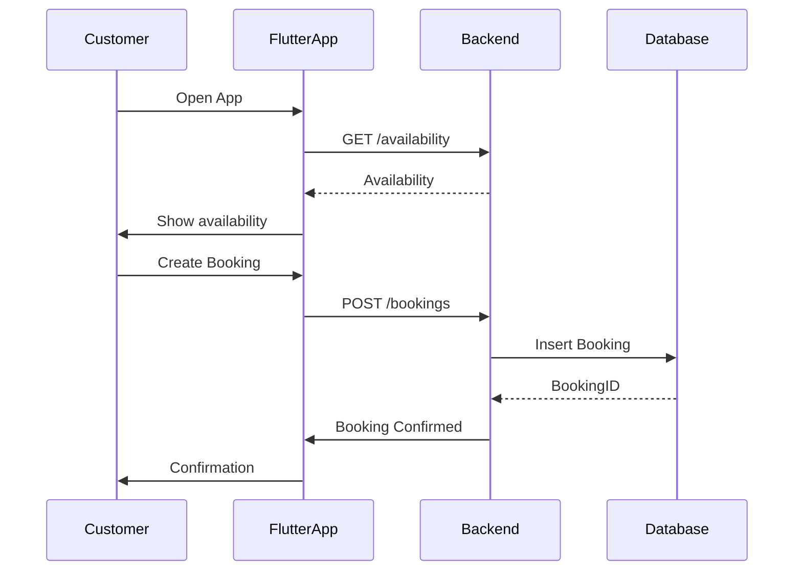
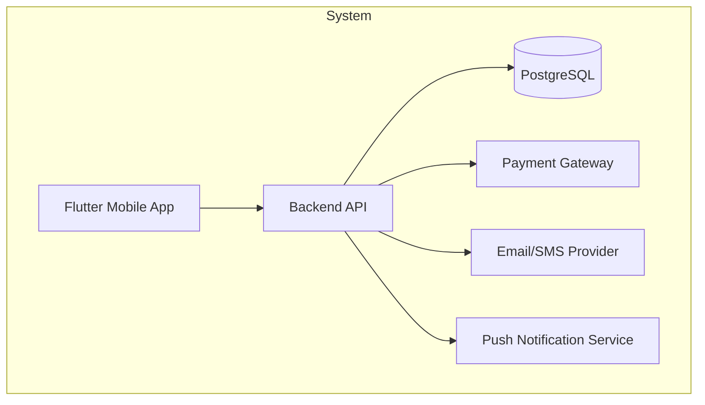

# Software Requirements Specification for CarCare

Version: 1.0
Date: 2026-05-04
Author: CarCare Development Team
Status: Draft

This document defines the MVP-focused software requirements for CarCare, a field service and automotive maintenance platform. It targets Flutter-based mobile clients (iOS/Android) with a back-end service and ancillary integrations (payments, notifications).

-------------------------------------------------------------------------------

## 1. Introduction

### 1.1 Purpose
- This SRS describes the MVP scope, functional and non-functional requirements, interfaces, data definitions, and acceptance criteria for the CarCare system.
- It is intended for the software development team (frontend/mobile, backend, QA, product management) and project stakeholders.

### 1.2 Scope
- MVP focus: core scheduling, service catalog, job tracking, invoicing, payments, notifications, and admin reporting.
- Platforms: Flutter-based mobile application (iOS/Android) with a back-end API and PostgreSQL database.
- In-scope: user management, service catalog, booking, job dispatch/tracking, invoicing, payments, notifications, basic admin dashboards.
- Out-of-scope: enterprise integrations beyond MVP scope, advanced analytics, multi-tenant support, advanced AI-driven recommendations.

### 1.3 Definitions, acronyms, abbreviations
- SRS: Software Requirements Specification
- MVP: Minimum Viable Product
- UI: User Interface
- API: Application Programming Interface
- SMS: Short Message Service
- PCI-DSS: Payment Card Industry Data Security Standard
- GDPR: General Data Protection Regulation

### 1.4 References
- Link or reference to any external documents, standards, or compliance guidelines.

### 1.5 Overview

### 1.6 Diagrams

Use Case Diagram (Mermaid code)
```mermaid
usecaseDiagram
actor Customer
actor Technician
actor Admin
Customer --> (Book Service)
Customer --> (View Invoices)
Technician --> (Update Job Status)
Admin --> (Manage Services)
Admin --> (View Reports)
```

Booking Sequence Diagram (Mermaid code)


Architecture Diagram (Mermaid code)


The document is organized into functional requirements (system features), external interfaces, non-functional requirements, data requirements, and architecture considerations. It also includes diagrams (embedded Mermaid code blocks) and separate Mermaid files for reference.

-------------------------------------------------------------------------------

## 2. Overall Description

### 2.1 Product perspective
- CarCare is a stand-alone mobile-first application with a back-end API and a PostgreSQL database. It may integrate with third-party payment gateways and notification providers.

### 2.2 Product functions (MVP)
- User management: registration, login, roles, password recovery.
- Service catalog: create/read/update/delete basic services with price and duration.
- Booking and scheduling: create/modify/cancel bookings; view availability; confirmations.
- Job tracking and dispatch: assign technicians; update statuses; basic offline considerations.
- Invoicing and payments: generate invoices; process card/mobile payments; basic tax/discount support.
- Notifications: email/SMS/push for key events.
- Admin reporting: revenue, bookings, utilization (basic dashboards).

### 2.3 User characteristics
- Customers: register, browse services, book, view invoices, pay.
- Technicians: view assigned jobs, update status.
- Admin/Owners: manage services, users, pricing, and reports.

### 2.4 Constraints
- Data privacy and security compliance (GDPR, PCI-DSS where applicable).
- Platform: Flutter mobile app; back-end accessible via REST/GraphQL.
- External services: payment gateway, email/SMS providers, push notifications.

### 2.5 Assumptions and dependencies
- Stable network connectivity for mobile clients.
- Availability of third-party services (payment gateway, SMS/email, push).

-------------------------------------------------------------------------------

## 3. System Features (Functional Requirements)

### 3.1 Feature: User Management (MVP)
- Description: Manage user accounts, roles, and authentication.
- Actors: Customer, Technician, Admin
- Functional requirements:
  - FR-1: Users can register with email or phone; identity verification optional for MVP.
  - FR-2: Users can log in/out with email/password; support for OAuth providers (optional MVP).
  - FR-3: Role-based access controls: Customer, Technician, Admin.
  - FR-4: Password recovery and basic multi-factor options (optional MVP).

### 3.2 Feature: Service Catalog (MVP)
- Description: Maintain a catalog of services with pricing and duration.
- FR-1: Create/read/update/delete service items (admin).
- FR-2: Each service has name, description, category, price, duration.
- FR-3: Admin can apply bulk pricing rules (optional MVP).

### 3.3 Feature: Booking and Scheduling (MVP)
- Description: Customers schedule appointments; system enforces availability.
- FR-1: Create, modify, cancel bookings.
- FR-2: Real-time availability checks for service durations (approximate for MVP).
- FR-3: Confirmations via UI and email/SMS (where configured).
- FR-4: Conflict prevention and basic retry logic for booking.

### 3.4 Feature: Job Tracking and Dispatch (MVP)
- Description: Track job status and assign technicians.
- FR-1: Update status: Scheduled, In Progress, On Hold, Completed, Cancelled.
- FR-2: Notify customers/technicians of status changes.
- FR-3: Mobile/desktop views; offline-friendly considerations for core flows.

### 3.5 Feature: Invoicing and Payments (MVP)
- Description: Generate invoices and process payments.
- FR-1: Create invoice on job completion or booking.
- FR-2: Payment gateway integration (cards/mobile wallets).
- FR-3: Taxes, discounts, and refunds (basic support).

### 3.6 Feature: Notifications (MVP)
- Description: Communicate events via email, SMS, or push.
- FR-1: Trigger notifications for key events (booking confirmed, status change, invoice issued).
- FR-2: Templates and basic localization support.

### 3.7 Feature: Admin Reporting (MVP)
- Description: Basic reporting and analytics for leadership.
- FR-1: Revenue, bookings, and technician utilization reports (date range filters).
- FR-2: Export options (CSV, PDF) for selected reports.

-------------------------------------------------------------------------------

## 4. External Interfaces

### 4.1 User interfaces
- Web UI: not required for MVP; primary is Flutter mobile app; responsive web may be added later.
- Mobile: Flutter-based iOS/Android app.

### 4.2 Hardware interfaces
- No dedicated hardware interfaces required for MVP.

### 4.3 Software interfaces
- Backend API (REST/GraphQL) and database (PostgreSQL).
- Payment gateway API; Email/SMS provider APIs; push notification service.

### 4.4 Communications interfaces
- HTTPS for client-server communication.
- Webhooks for real-time notifications (where supported).

-------------------------------------------------------------------------------

## 5. Other Non-Functional Requirements

### 5.1 Performance
- App and API should respond within 2 seconds on primary screens under typical load.
- API responses under 500 ms for core flows under normal load.

### 5.2 Security
- SOC 2-aligned controls; JWT-based auth; short-lived tokens.
- Data encryption at rest and in transit; RBAC; input validation; logging.

### 5.3 Reliability & Availability
- 99.9% uptime target in production; graceful degradation and retry logic.

### 5.4 Maintainability & Supportability
- Clear API contracts, versioning, and documentation; observability with logging, metrics, tracing.

### 5.5 Portability
- Cloud deployment capability; containerized (Docker) where feasible; multi-cloud friendly.

### 5.6 Accessibility
- WCAG 2.1 AA where applicable to app UI.

### 5.7 Localization/Internationalization
- Support for multiple languages and currencies.

-------------------------------------------------------------------------------

## 6. Data Requirements

### 6.1 Data model overview
- Core entities: User, Service, Booking, Job, Invoice, Part, Payment, Notification, Location, Inventory.

### 6.2 Data dictionary (sample)
- User(UserID, Email, Phone, PasswordHash, Role, CreatedAt, Status)
- Service(ServiceID, Name, Description, Category, Price, Duration)
- Booking(BookingID, UserID, ServiceID, LocationID, StartTime, EndTime, Status)
- Job(JobID, BookingID, TechnicianID, Status, Notes)
- Invoice(InvoiceID, JobID, Amount, Tax, Total, Status, IssuedAt)
- Part(PartID, SKU, Name, Quantity, Location)
- Payment(PaymentID, InvoiceID, Amount, Method, Status, Timestamp)
- Notification(NotificationID, UserID, Type, Message, SentAt)
- Location(LocationID, Name, Address, Timezone)

-------------------------------------------------------------------------------

## 7. System Architecture and Design Constraints
- High-level architecture: Flutter mobile app + REST/GraphQL backend + database; external service integrations for payments and notifications.
- Data privacy and regulatory constraints (GDPR, PCI-DSS where applicable).
- Deployment considerations (CI/CD pipelines, containerization, and monitoring).

-------------------------------------------------------------------------------

## 8. Use Cases / User Scenarios
- Use Case 1: Customer books a service
- Use Case 2: Admin updates pricing
- Use Case 3: Technician updates job status
- Use Case 4: Customer pays an invoice
- Use Case 5: Admin generates revenue report

-------------------------------------------------------------------------------

## 9. Traceability
- A simple traceability matrix will map each functional requirement to the corresponding feature and use case.
- RTM will be maintained in a separate table or spreadsheet in the project repo.

-------------------------------------------------------------------------------

## 10. Appendices

### 10.1 Glossary
- TBD

### 10.2 References
- TBD

### 10.3 Assumptions
- TBD

-------------------------------------------------------------------------------

## 11. Revision History

- Version 1.0, 2026-05-04, Author: CarCare Dev Team, Initial draft.

-------------------------------------------------------------------------------

## Elicitation questions for finalizing the SRS
- Scope and boundaries for MVP release: confirm features in MVP vs future releases.
- Stakeholders: product owners, technicians, and lead developers.
- Platforms: confirm iOS/Android targets; any web-only requirements.
- MVP acceptance criteria: what must be complete and sign-off-ready for MVP.
- Integrations: which payment gateway(s) and notification providers to integrate with in MVP.
- Data retention and privacy: define retention periods and deletion policies.
- Security: roles and permissions for each user type; authentication requirements.
- Localization: target languages and currencies for MVP.
- Performance targets: p95 latency, peak user counts for MVP.
- Data model migration: any existing data to migrate.
- Diagrams: confirm preferred diagrams and stakeholders for review.

- Next steps: fill sections with stakeholder input; finalize RTM; generate PDF.

### Next steps for PDF generation
- Render Mermaid diagrams to PNGs (use mermaid CLI) and embed images in the Markdown before PDF conversion.
- Generate PDF from Markdown using Pandoc: pandoc SRS_CarCare.md -s -o SRS_CarCare.pdf --pdf-engine=xelatex
- On Windows, use a helper script (see scripts/convert_srs_to_pdf.ps1) after diagram rendering.

-------------------------------------------------------------------------------

## How you can proceed (summary)
- Provide scope and platform preferences; verify MVP features.
- Populate the SRS with stakeholder input; run an elicitation session.
- Render diagrams to images and embed them in the Markdown for PDF accuracy.
- Use the provided scripts to generate a PDF and distribute to stakeholders.

If you’d like, I can tailor this starter to your exact scope and platform preferences or generate a Word/PDF-ready version on request.
